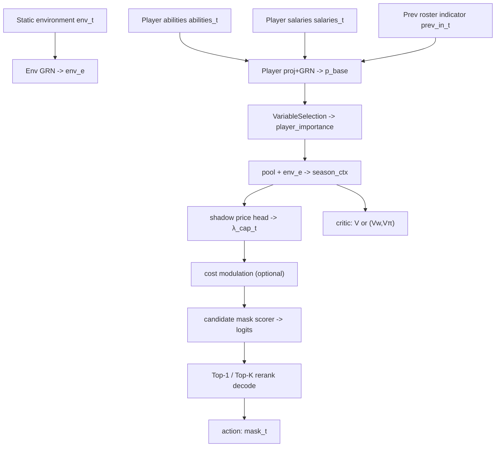

# A Temporal- and Attention-based Network for WNBA Roster Decisions

## Introduction

The model in [model_general.md](model_general.md) formulates WNBA roster selection as an MDP. In season $t$, the state includes the player ability matrix $\mathbf{A}_t$, environment variables $\mathbf{e}_t=(N_t,C_t,G_t)$, and the previous-season roster $\mathbf{x}_{t-1}$. For small instances, the exact solver in [traditional_solution.md](traditional_solution.md) can enumerate feasible rosters and compute the globally optimal decision sequence via DP, producing abundant supervised training pairs (“state → optimal action”).

However, as the number of candidates and/or seasons increases, exact enumeration becomes intractable. We therefore train a neural policy network to approximate the optimal policy.

To exploit temporal dependence and provide adaptive, interpretable feature selection, we take inspiration from the **Temporal Fusion Transformer (TFT)** family of ideas: gated residual networks, instance-wise variable selection, local temporal processing, and interpretable attention. This document describes a network design tailored to the roster decision setting.

---

## Key building blocks (TFT-inspired)

The design highlights:

1. **Static/context encoder**: map environment parameters into context vectors used throughout downstream modules.
2. **Gated Residual Network (GRN)**: each submodule uses a residual path plus a learnable gate, allowing the model to skip unnecessary nonlinear transformations.
3. **Variable selection**: for each instance and time step, compute softmax weights over variables/players to focus on the most decision-relevant inputs.
4. **Local temporal processing**: a lightweight recurrent module (e.g., LSTM over seasons) captures short-range temporal patterns.
5. **Interpretable attention**: attention over time steps can capture longer-range dependencies and provide weights that are easier to interpret.

---

## Network design for WNBA roster decisions

### Inputs and feature representation

At decision time in season $t$, the state $s_t$ includes:

| Input type | Definition and handling |
| --- | --- |
| Environment $\mathbf{e}_t$ | League size $N_t$, salary cap $C_t$, season games $G_t$, etc. Encoded via an env projection + GRN into an environment embedding. |
| Previous roster $\mathbf{x}_{t-1}$ | A binary indicator for each candidate. Used as a feature alongside player abilities/costs. |
| Ability matrix $\mathbf{A}_t$ | Continuous features are projected into $d_{\text{model}}$-dim embeddings (after normalization). |
| Salary $c_{i,t}$ and other costs | Typically normalized to ratios (e.g., $c_{i,t}/C_t$) and embedded/projection layers are applied. |

### Variable selection and gating (interpretability)

We treat the “player dimension” as a structured set of variables. For each season $t$:

1) Project each player’s concatenated feature vector (abilities, cost ratio, previous inclusion) into a player embedding $\mathbf{p}_{i,t}$.

2) Compute a softmax importance weight $\alpha_{i,t}$ over players (variable selection). This yields an interpretable signal: **which players matter most** in the current state.

3) Pool a season context vector via a weighted sum: $\sum_i \alpha_{i,t}\,\mathbf{p}_{i,t}$, then fuse with the environment embedding.

### Shadow price and cost modulation (explicit constraint conditioning)

To make salary-cap sensitivity explicit and interpretable, we introduce:

- A nonnegative scalar “shadow price” head $\lambda^{\mathrm{cap}}_t\ge 0$ (stored as `lambda_t` in code)
- Embedding-level cost modulation:

$$
\mathbf{p}_{i,t} \leftarrow \mathbf{p}_{i,t} - \lambda^{\mathrm{cap}}_t\,\mathrm{Proj}(c_{i,t}/C_t)
$$

Intuition: when the cap is tight, the model increases cost sensitivity by raising $\lambda^{\mathrm{cap}}_t$.

### Candidate scoring over feasible rosters (structured action)

Actions are **feasible roster masks**, not independent per-player 0/1 decisions. Let $m$ index a feasible roster mask.

For each candidate roster $m$:

- Use the mask to aggregate player embeddings into a roster embedding
- Concatenate: season context, cost ratio, churn ratio
- Pass through GRN stacks to output a logit for roster $m$

### Critic (value function, optionally decomposed)

The final configuration uses a decomposed critic:

- Predict $V^W$ (wins-return component) and $V^\Pi$ (profit-return component)
- Combine using $\lambda_{\text{win}}$ to form $V$

This makes the value estimate more interpretable and can stabilize learning.

---

## Architecture sketch (Mermaid)

---

## Repo-consistent design notes (what the current code implements)

This repository focuses on an implementation that is consistent with exact DP labels and constrained action spaces.

### 1. Why approximate with a neural policy

For small scale (e.g., `n_players<=15, T<=3`), we can solve exactly by enumerating feasible rosters and running DP. For larger scale, enumeration is not feasible, so we learn a policy $\pi_\theta(a\mid s)$.

### 2. Action-space design: classify feasible roster masks

- Actions are complete roster masks.
- We pre-enumerate masks satisfying the size constraint and filter by cap feasibility per season.
- The policy outputs logits over the candidate mask set.

Benefits:

- Feasibility is enforced by construction (the candidate set is feasible or easy to filter).
- Each action is human-readable (“this exact roster”), improving interpretability.

### 3. Model structure (matching code)

Implementation: `TFTPolicy` in [src/mcm_2026_d/nn/model.py](src/mcm_2026_d/nn/model.py).

#### 3.1 Inputs per season

- Player abilities: `abilities_t: (B,n,K)`
- Player salaries: `salaries_t: (B,n)` (normalized as `salary_scaled = salary/C_t`)
- Previous inclusion: `prev_in_t: (B,n)`
- Environment: `env_t: (B,E)`; the final setup uses `E=9` (base 6 + 3 derived constraint features)

#### 3.2 Season encoder with variable selection

- Project `[abilities, salary_scaled, prev_in]` into `d_model` and apply GRN
- VariableSelection outputs `player_importance` (softmax)
- Pool into a season context vector `season_ctx`

Interpretation: “which players/features are most critical under the current state”.

#### 3.3 Shadow price and cost modulation

- Shadow price head: $\lambda^{\mathrm{cap}}_t\ge 0$ (`lambda_t`)
- Embedding-level modulation: $\mathbf{p}_{i,t} \leftarrow \mathbf{p}_{i,t}-\lambda^{\mathrm{cap}}_t\,\mathrm{Proj}(c_{i,t}/C_t)$

#### 3.4 Candidate scorer

For each candidate roster mask $m$:

- Mask-weighted sum of player embeddings → roster embedding
- Concatenate `season_ctx`, `cost_ratio`, `churn_ratio`
- GRN stack → logit

#### 3.5 Critic (decomposed)

- Predict $V^W$ and $V^\Pi$
- Combine by $\lambda_{\text{win}}$; train with separated supervision to avoid collapse

---

## Inference: Top-K rerank decoding

Using only Top-1 by logits can pick the wrong action due to small scoring errors. The final inference/evaluation strategy is:

1) Take Top-K candidates by logits
2) Re-score them using the environment reward/objective
3) Choose the best after re-scoring

This does not change training, but it can substantially improve the final ratio (closer to DP optimum).

---

## Training pipeline (BC → RL)

Training details and formulas are in [train_strategy.md](train_strategy.md). At a high level:

- **BC (Behavior Cloning):** supervise on DP-optimal mask sequences
- **RL (Actor–Critic + AWBC):** directly optimize the environment reward/objective; critic reduces variance; AWBC prevents policy drift

<!-- end -->
