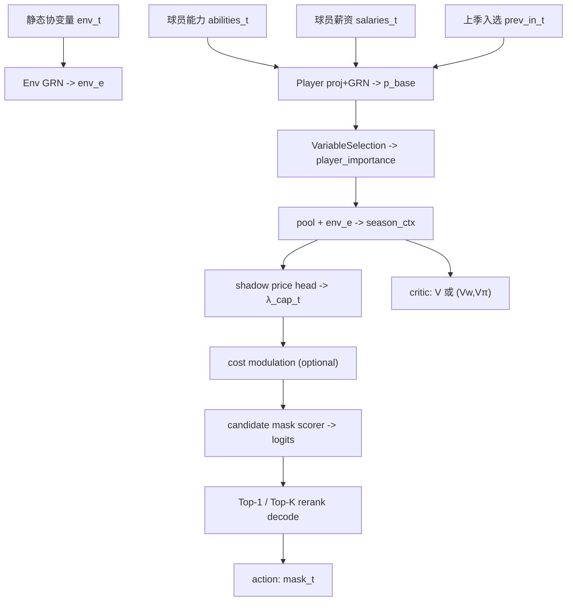

# 结合时序信息与注意力机制的 WNBA 阵容决策网络设计

## 引言

前述模型（见 `model_general.md`）将 WNBA 球队的阵容选择建模为马尔可夫决策过程(MDP)，输入包括各赛季球员能力矩阵$\mathbf{A}_t$、环境变量$\mathbf{e}_t=(N_t,C_t,G_t)$以及上一赛季阵容$\mathbf{x}_{t-1}$。通过传统的小规模穷举算法（`traditional_solution.md`）可以在少数候选球员、短规划期下精确求解最优决策，并导出大量“状态–最优动作”对作为监督数据。然而，当球员数量或赛季数增加时，穷举方法将变得不可行，因此需要训练一个能够近似最优策略的神经网络。

为了充分利用过去和未来的时序信息，并赋予模型对输入变量和时间依赖的自适应关注能力，我们参考 **Temporal Fusion Transformer (TFT)** 架构:contentReference[oaicite:0]{index=0}。TFT 为多步时间序列预测设计，包含静态变量编码器、门控残差网络、实例化变量选择机制、局部处理的序列到序列层以及可解释的自注意力层，可同时捕捉短期和长期依赖且具备可解释性。下面先简要介绍该模型的关键思想，再结合 WNBA 阵容决策问题，设计一个针对性的深度网络。

## Temporal Fusion Transformer 的主要构成

TFT 的设计充分考虑多步时间序列中的各种输入类型——静态协变量、已知的未来输入和只在历史出现的变量。论文指出其核心创新包括：

1. **静态协变量编码器**：专门的编码器将时间不变的特征映射为一组上下文向量，供下游模块使用:contentReference[oaicite:1]{index=1}。这些上下文在后续的变量选择、局部处理和静态增强层中起到条件作用。
2. **门控残差网络 (Gated Residual Network, GRN)**：每个子模块都通过 GRN 处理输入并与原输入做残差相加，结合门控线性单元 (GLU) 以可学习地跳过不需要的非线性处理:contentReference[oaicite:2]{index=2}。这种门控机制赋予模型灵活性，能根据数据规模自适应调整深度和复杂度。
3. **变量选择网络**：对于每个时间步的多维输入，通过 GRN 生成一组归一化的变量权重，按权重对每个特征经 GRN 处理后进行加权求和:contentReference[oaicite:3]{index=3}。该机制能够在每个样本和时间步选择最关键的特征，减少噪声干扰。
4. **序列到序列局部处理层**：采用 LSTM 编码器–解码器对有限长度的历史和未来输入做局部处理:contentReference[oaicite:4]{index=4}。这不仅提供了基于局部邻域的模式提取，而且通过静态上下文向量初始化 LSTM 的状态，使静态信息影响局部动态。
5. **静态增强层与自注意力层**：局部处理后的时间特征通过 GRN 与静态上下文融合，随后以改进的多头自注意力机制学习不同时间步之间的长期依赖:contentReference[oaicite:5]{index=5}。TFT 修改了标准多头注意力，使各注意力头共享值向量并进行加法聚合，从而更易解释注意力权重:contentReference[oaicite:6]{index=6}。

这些模块结合使用，使 TFT 能够同时学习局部模式和全局时序依赖，并通过变量选择与门控机制提高模型的可解释性和稳定性。

## WNBA 阵容决策网络设计

本节结合上文总结的 TFT 架构，针对 WNBA 阵容优化问题设计一个深度网络。目标是利用传统方法生成的小规模最优解作为监督信号，训练一个模型在大规模候选球员集和多个赛季场景下快速给出接近最优的阵容决策。

### 输入与特征表示

在赛季 $t$ 做出决策时，状态 $s_t$ 包含以下信息：

| 输入类型 | 定义与处理 |
| --- | --- |
| 静态协变量 $\mathbf{e}_t$ | 当季联盟队数 $N_t$、工资帽 $C_t$、赛季场次 $G_t$ 等信息属于当季已知的环境参数，将其输入静态编码器通过 GRN 生成多个上下文向量 $c_s, c_c, c_h, c_e$:contentReference[oaicite:7]{index=7}。|
| 上一赛季阵容 $\mathbf{x}_{t-1}$ | 表示每名候选球员是否在上赛季阵容中。对于二进制向量，可通过嵌入层映射至 $d_{\text{model}}$-维表示，或与球员能力结合作为时间依赖输入。|
| 当前赛季球员能力矩阵 $\mathbf{A}_t$ | 每名候选球员有 $K$ 个能力维度 $a^{(k)}_{i,t}$。对连续特征使用线性映射转为 $d_{\text{model}}$ 维嵌入，对分类特征（位置、合同类型等）使用实体嵌入:contentReference[oaicite:8]{index=8}。|
| 当前工资 $c_{i,t}$ 与其他成本参数 | 连续变量，线性映射到 $d_{\text{model}}$ 维后与能力嵌入拼接；也可在后续变量选择中作为一个独立输入变量。|

### 变量选择与门控机制

对于每个时间步，我们将“球员维度”视为多维输入，其中包括能力嵌入、成本、上赛季是否入选等特征。按照 TFT 的变量选择网络构建方法:contentReference[oaicite:9]{index=9}：

1. **特征变换**：对每个球员特征向量 $\xi^{(j)}_t$ 通过单独的 GRN 处理生成 $\tilde{\xi}^{(j)}_t$。不同球员间共享权重，以保持模型参数的统一性。
2. **生成变量权重**：将所有球员特征在时间步 $t$ 上展平为 $\Xi_t$，与静态上下文向量 $c_s$ 一同输入另一个 GRN，随后经 softmax 得到归一化权重向量 $v_{\chi,t}$:contentReference[oaicite:10]{index=10}。这些权重反映每个球员在该状态下对目标的贡献度。
3. **加权组合**：用权重对各球员的 GRN 输出求和得到 $\tilde{\xi}_t = \sum_j v_{\chi,t}^{(j)} \tilde{\xi}^{(j)}_t$，作为此时间步的聚合特征。
4. **门控残差**：所有 GRN 输出均通过门控线性单元进行残差连接:contentReference[oaicite:11]{index=11}。门控参数可抑制不必要的非线性，实现自适应深度。

该机制的优势在于可以**实例化**选择最具价值的球员特征，减少噪声对策略的干扰。同时，softmax 权重提供了球员重要度，可辅助解释模型的推荐原因。

### 序列到序列局部处理层

在动态规划问题中，不同赛季之间存在明显的时序依赖——上一季阵容会影响下一季状态和奖励函数。参考 TFT 在局部模式抽取方面的设计，我们采用 LSTM 编码器–解码器对有限长度历史（过去 $k$ 个赛季）和未来已知输入（例如确定的工资帽、赛程）进行局部处理:contentReference[oaicite:12]{index=12}。

具体操作如下：将每个时间步经过变量选择得到的聚合特征 $\tilde{\xi}_t$ 组成时间序列 $\tilde{\xi}_{t-k:t}$，作为编码器输入；将预先知道的未来环境变化（例如联盟计划中的工资帽增幅）组成 $\tilde{\xi}_{t+1:t+\tau}$ 作为解码器输入，得到统一长度的时间特征 $\phi(t,n)$:contentReference[oaicite:13]{index=13}。为了让静态信息参与局部处理，使用静态上下文向量 $c_c$ 和 $c_h$ 初始化 LSTM 的细胞状态与隐藏状态:contentReference[oaicite:14]{index=14}。此外，对这一层加入门控残差连接，实现对 LSTM 层的可跳过处理:contentReference[oaicite:15]{index=15}。

### 静态增强与自注意力层

局部处理后得到的时间特征 $\phi(t,n)$ 会通过 GRN 与静态上下文 $c_e$ 融合，形成静态增强特征 $\theta(t,n)$:contentReference[oaicite:16]{index=16}。然后，所有时间位置的静态增强特征组成矩阵 $\Theta(t)$，进入**可解释的多头自注意力层**:contentReference[oaicite:17]{index=17}。该注意力层共享各头的值向量并采用加法聚合，能捕捉长期依赖并使注意力权重具有清晰含义；实现上类似 Transformer 的多头注意力，但通过共享值向量和平均聚合提高可解释性:contentReference[oaicite:18]{index=18}。

注意力输出后，再经过一层 GRN 加门控残差，形成最终的时间特征 $\psi(t,n)$，此特征可以理解为对历史 $k$ 个赛季和未来 $\tau$ 期环境的综合描述，具有局部模式与长期依赖信息:contentReference[oaicite:19]{index=19}。

### 输出层与约束处理

模型需要输出在赛季 $t$ 的阵容选择 $\hat{\mathbf{x}}_t$。由于决策变量为二进制，并受工资帽 $C_t$ 和阵容人数 $[L,U]$ 等约束，应采用两步方法：

1. **球员评分预测**：
   - 利用变量选择权重 $v_{\chi,t}^{(j)}$ 和时间特征 $\psi(t, n=0)$ 生成每个球员的“价值评分”或入选概率。具体可将时间特征通过线性层映射到维度 $m_{\chi}$ 与球员数一致，或者为每个球员保留对应的 GRN 特征进行逐个预测。
   - 采用 sigmoid 激活输出 $p_{i,t}\in (0,1)$ 表示球员入选的概率，训练时以传统解法的最优阵容作为监督，使用二元交叉熵损失。

2. **约束满足的解码器**：
   - 由于直接预测二进制阵容难以保证满足工资帽和人数限制，可以在推理阶段使用启发式解码：按照预测概率 $p_{i,t}$ 从高到低排序，逐个加入阵容，直到满足人数下限且工资帽不超限，剩余球员按概率继续尝试；如果超出工资帽则跳过成本较高的球员。
   - 另一种方式是在网络内部引入指针网络或组合优化层（如可微排序）以约束输出。本报告侧重网络结构，故建议使用排序解码器完成约束处理。

### 损失函数与训练策略

对于监督任务，选用传统解法导出的最优阵容 $\mathbf{x}_t^\star$ 作为标签。模型输出的入选概率 $p_{i,t}$ 通过二元交叉熵损失与 $x^\star_{i,t}$ 对齐。若希望模型输出完整的多赛季序列，可用加权交叉熵对所有赛季损失求和，同时加入 L2 正则、防止过拟合。

此外可考虑多任务目标，如同时预测综合实力 $Q_t$ 或未来胜场 $W_t$，以增加训练信号。采用时序训练时，可使用教师强制，在解码每个时间步输入真实的上一赛季阵容；推理时采用模型自身的输出。

## 模型结构图

下图用 Mermaid 流程图描述了整个网络架构。每个模块均与 TFT 的相应组件对应，但针对阵容决策任务进行了输入建模和输出调整。

本文档从“实现一致性”的角度解释当前仓库的神经网络方案：它不是泛化的 TFT 论文复刻，而是吸收了其中的**门控/变量选择**思想，并针对“阵容=组合动作”做了结构化设计。

更详细的训练与 RL 推导、分级结构图见：[train_strategy.md](train_strategy.md)。

   ---

## 1. 为什么要做神经网络近似

   对于小规模（例如 `n_players<=15, T<=3`），我们可以用“枚举可行阵容 + 动态规划（DP）”得到全局最优策略和最优 objective。

   但在更大规模时，穷举不可扩展，因此需要一个“学出来的策略网络”来近似 DP 的决策。

   ---

## 2. 动作空间设计：对可行 roster mask 做分类

   本项目的核心建模选择是：

- **动作不是逐球员独立 0/1 决策**，而是一个“完整阵容 mask”。
- 先枚举所有满足人数约束的候选 mask，并在每赛季结合工资帽筛选可行动作。
- policy 输出对所有候选 mask 的 logits。

   优点：

- 强约束天然满足（动作集合本身就可行/或更易筛）
- 每个动作是“可读的阵容”，可解释性强

   ---

## 3. 模型结构（与代码一致）

   实现位于：[src/mcm_2026_d/nn/model.py](src/mcm_2026_d/nn/model.py) 的 `TFTPolicy`。

### 3.1 输入

   每个赛季 $t$ 的状态由三部分组成：

- 球员能力 `abilities_t: (B,n,K)`
- 球员薪资 `salaries_t: (B,n)`（会归一化到 `salary_scaled = salary/C_t`）
- 上季入选 `prev_in_t: (B,n)`
- 环境 `env_t: (B,E)`，最终采用 `E=9`（基础 6 + 3 个约束衍生特征）

### 3.2 Season Encoder：变量选择（可解释）

- 把每个球员的 `[abilities, salary_scaled, prev_in]` 投影到 `d_model` 维并经过 GRN
- 通过 VariableSelection 得到每个球员的重要度权重 `player_importance`（softmax）
- 聚合得到赛季上下文 `season_ctx`

   这一步给出一种直观可解释信号：

- “当前状态下哪些球员/特征更关键”

### 3.3 影子价格（shadow price）与成本调制

   为增强对工资帽约束的条件化能力，我们引入：

- 影子价格标量头：$\lambda^{\mathrm{cap}}_t\ge 0$（代码字段 `lambda_t`）
- 成本调制：在 embedding 层面做 $\mathbf{p}_{i,t} \leftarrow \mathbf{p}_{i,t}-\lambda^{\mathrm{cap}}_t\,\mathrm{Proj}(c_{i,t}/C_t)$

   这让模型的“成本敏感度”显式化，并且可解释。

### 3.4 Candidate Scorer：对候选 roster 打分

   对每个候选 roster mask $m$：

- 用 mask 对球员 embedding 做加权求和得到 roster embedding
- 拼接 `season_ctx`、`cost_ratio`、`churn_ratio`
- 经过 GRN 堆叠输出该 mask 的 logit

### 3.5 Critic：价值函数（分项可解释）

   最终采用分项 critic：

- 预测 $V^W$（胜场项回报）与 $V^\Pi$（利润项回报）
- 用 $\lambda_{\text{win}}$ 合成 $V$，并在训练时分别监督两项回报，使分解不退化

   ---

## 4. 推理策略：Top-K 复评解码

   仅靠 logits Top-1 可能因为轻微误差选错动作。

   最终采用的推理/评估策略：

   1) 取 logits Top-K 候选动作
   2) 用环境 reward/objective 对候选动作复评
   3) 选复评最优者

   它不会改变训练过程，但会显著提升最终 ratio（更接近 DP 最优）。

   ---

## 5. 训练流程（BC → RL）

   训练细节与公式推导见：[train_strategy.md](train_strategy.md)。这里给结论版：

- BC（Behavior Cloning）：用 DP 产生的最优 mask 序列作为监督标签
- RL（Actor-Critic + AWBC）：用环境 reward 直接优化 objective，并通过 critic 降低方差、用 AWBC 防止策略漂移

<!-- end -->
