# Plots 说明（验证集 + 不同 U 约束）

本文档解释 **本次训练 run** 导出的评估折线图含义，以及“理想情况下应达到的水平/趋势”。

本次 run 的图片统一放在一个更“正常”的目录（便于写论文/报告引用，不和训练权重混在一起）：

- 训练过程曲线（loss / greedy rollout 等）：`docs/figures/nn/ab3b_constraint_shadow_cost_critic_adam_lrsmall_es8_e100_bs32/train/`
- 逐 checkpoint 评估曲线（推荐用于最终结果；Top-K 复评解码）：`docs/figures/nn/ab3b_constraint_shadow_cost_critic_adam_lrsmall_es8_e100_bs32/eval/`

> 说明：训练目录（`datasets/nn_runs/...`）会被 `.gitignore` 忽略且会清理中间权重；
> 文档图片目录（`docs/figures/...`）适合保留/提交。

> 说明：这些图来自训练时写出的 `metrics.jsonl`（每个 epoch 都会在 **随机验证集** 上评估，并对不同上界 `U` 计算 DP 最优作为对照），因此它们主要用来观察：
>
> 1) 模型是否在验证集上随训练变好（收敛）；
> 2) 在 **不同 roster 人数上界 U** 下，模型决策与最优策略的关系是否更接近。

> 重要：我们优先使用“基于目标函数”的评价（objective / gap / regret / ratio）。
> `accuracy` 作为补充参考即可，因为 DP 最优可能存在**多解**，严格动作匹配率会被低估。

> 如果你发现“只能看到一条线（例如绿色 U=13）”：通常不是绘图错误，而是不同 U 的数值非常接近，曲线重叠后最后绘制的那条把其他线盖住了。
> 为避免这种视觉重叠，本项目额外输出了 **facets（按 U 分面）** 的图，每个 U 单独一个子图。

---

## 1) `val_obj_greedy_by_u.png`（不同 U 下的验证集 objective）

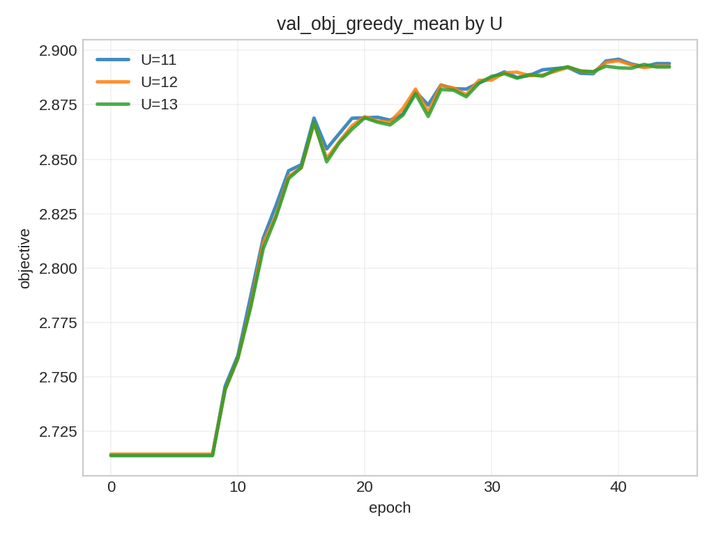

（按 U 分面，推荐查看）

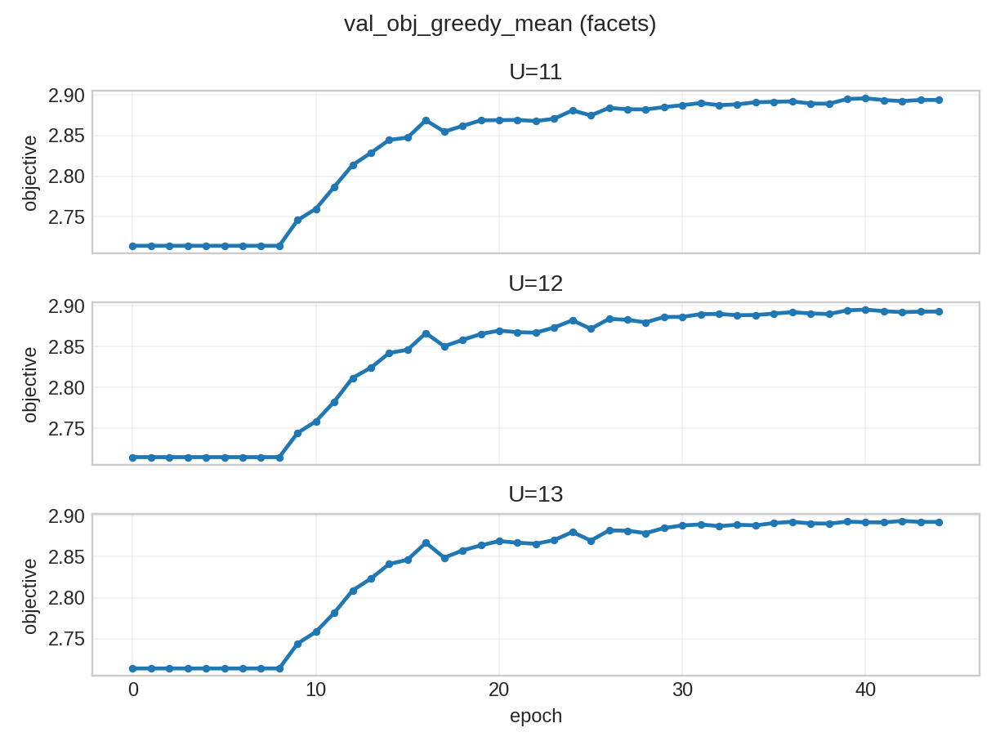

- 理想水平/趋势
  - **对每条曲线（每个 U）**：随 epoch 上升或趋稳。
  - **不同 U 的相对关系**：更大的 U 提供更大的动作空间，理论最优 objective 上界更高；
    但模型是否能“用上”这个自由度取决于训练是否充分。
- 图的意义
  - 衡量策略对“阵容人数上界变化”的泛化/鲁棒性。
  - 如果只在训练的 U 上好、换 U 明显崩，则说明模型对约束条件的条件化不足（或 scorer 对 cost/churn 的归纳不好）。

> 备注：如果你发现 U=11/12/13 三条线非常接近甚至重合，这并不罕见——在某些验证子集上，放宽 U 并不会带来明显的最优值提升。

---

## 2) `val_gap_by_u.png`（不同 U 下：模型与 DP 最优的差距）

（更推荐先看 best-so-far 版本：它不会因为中间波动而看起来“很乱”）

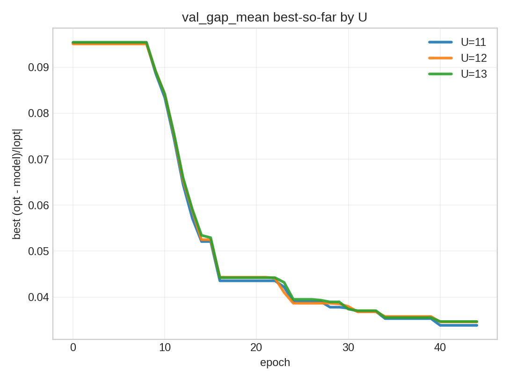

（按 U 分面 best-so-far，推荐查看）

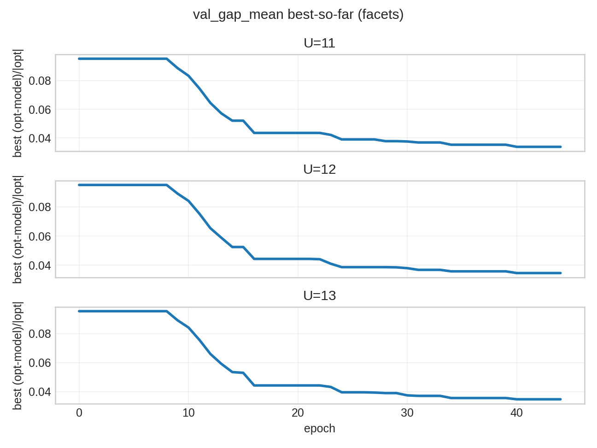

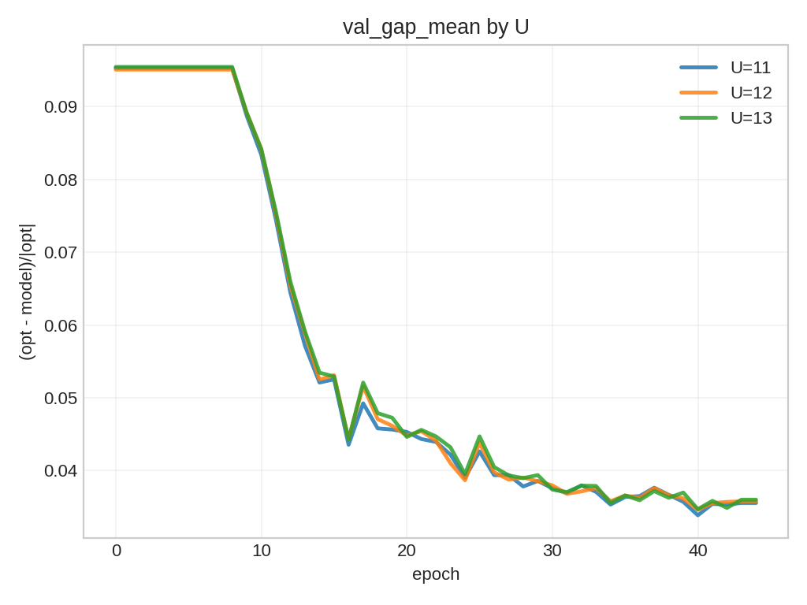

（按 U 分面，推荐查看）

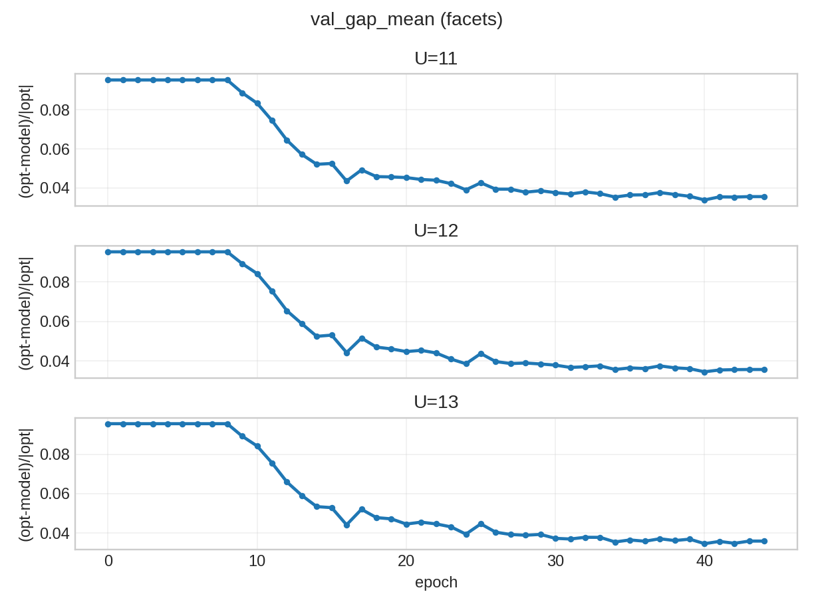

- 定义（本项目实现）
  - $\text{gap} = \frac{J^*(s) - J^{\pi}(s)}{|J^*(s)| + \epsilon}$，其中 $J^*$ 是 DP 最优 objective，$J^{\pi}$ 是模型贪心 rollout objective。
  - gap 越接近 0 越好；若为正表示模型落后于最优。
- 理想水平/趋势
  - 随 epoch **下降并靠近 0**。
  - 经验上（仅作直觉参考）：
    - `gap < 0.05`：非常接近最优
    - `gap ~ 0.05~0.15`：可用但仍有改进空间
    - `gap > 0.2`：通常说明策略还没学稳/泛化不足
- 图的意义
  - 这是“决策—最优方案之间关系变化”的核心折线图：直接把模型策略与 DP 最优对齐程度可视化。

---

## 3) `val_obj_ratio_by_u.png`（不同 U 下：目标函数比值 model/opt）

（更推荐先看 best-so-far 版本：更直观展示“到目前为止最好能到多少”）

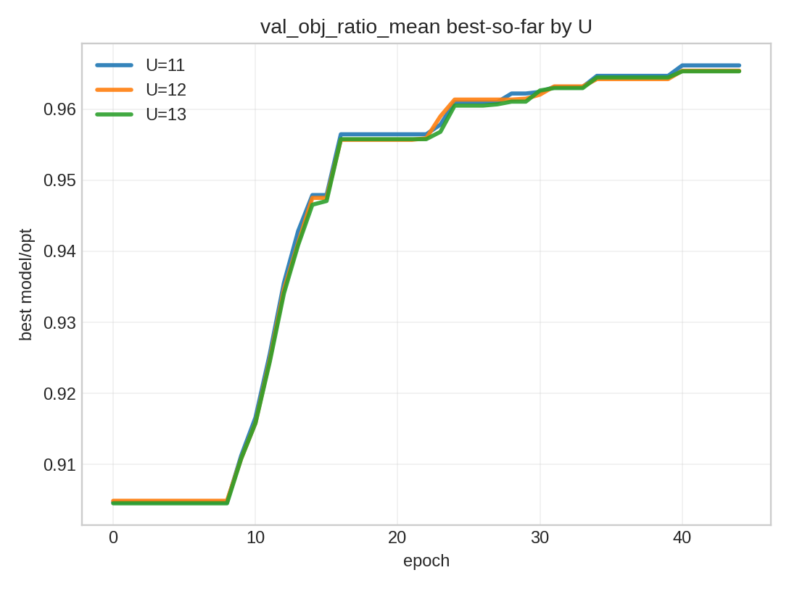

（按 U 分面 best-so-far，推荐查看）

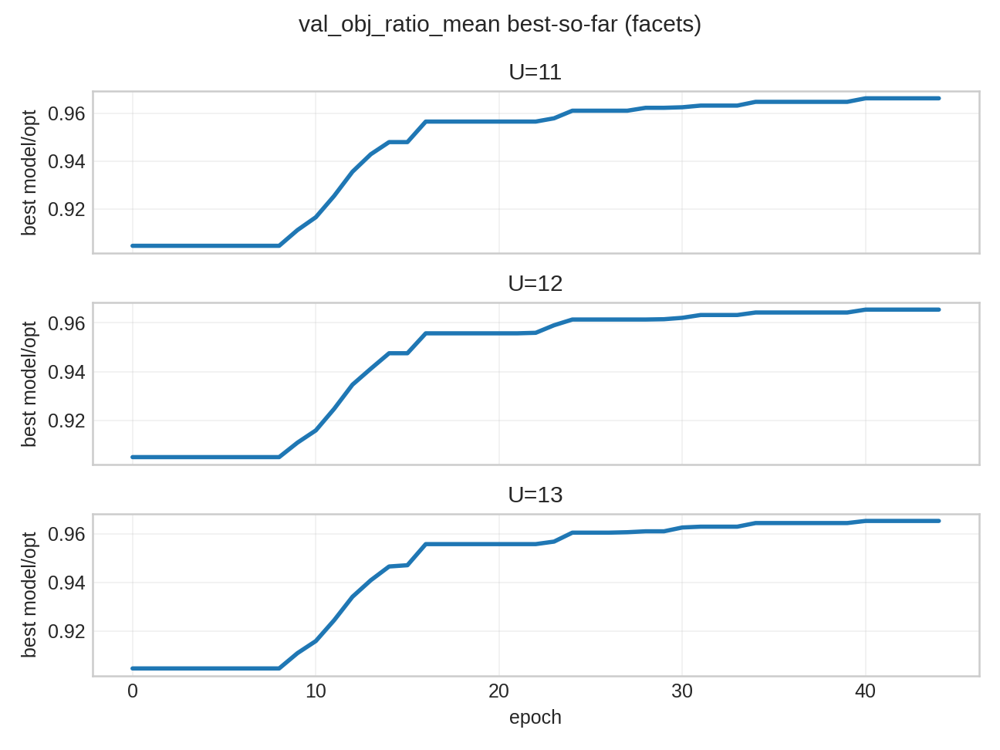

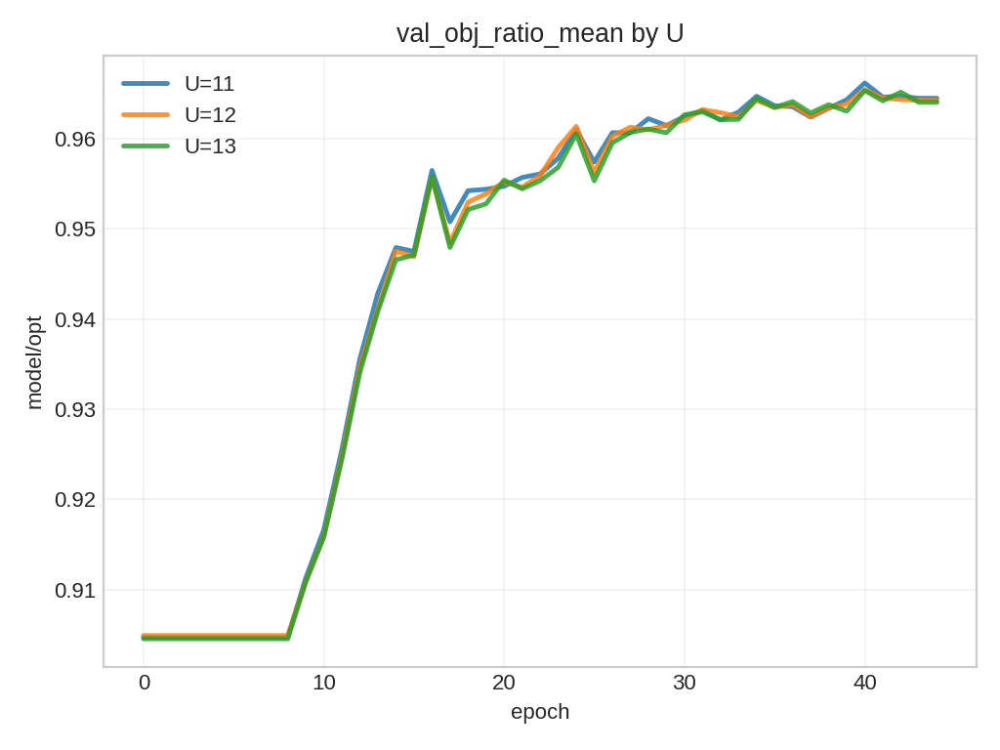

（按 U 分面，推荐查看）

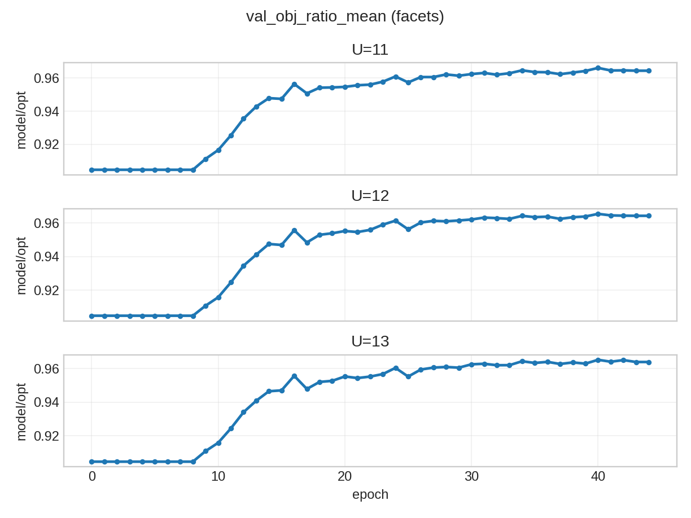

- 定义
  - $\text{ratio} = \frac{J^{\pi}(s)}{J^*(s) + \epsilon}$
- 理想水平/趋势
  - 越接近 1 越好，并随 epoch 上升。
  - 经验上（仅作直觉参考）：
    - `ratio >= 0.90`：已经非常接近传统 DP（你当前的目标）
    - `ratio ~ 0.80~0.90`：能明显用，但可能还差一个训练/调参迭代
    - `ratio < 0.75`：通常说明策略还不稳定或价值头没学好
- 图的意义
  - 这是“基于目标函数”的直观指标：策略达到最优的百分比。

> 注意：如果某些样本的 `J*` 很小（接近 0），ratio 会变得不稳定；因此我们同时看 regret/gap 以避免被少数样本影响。

---

## 4) `val_regret_by_u.png`（不同 U 下：目标函数后悔值 opt - model）


（按 U 分面，推荐查看）

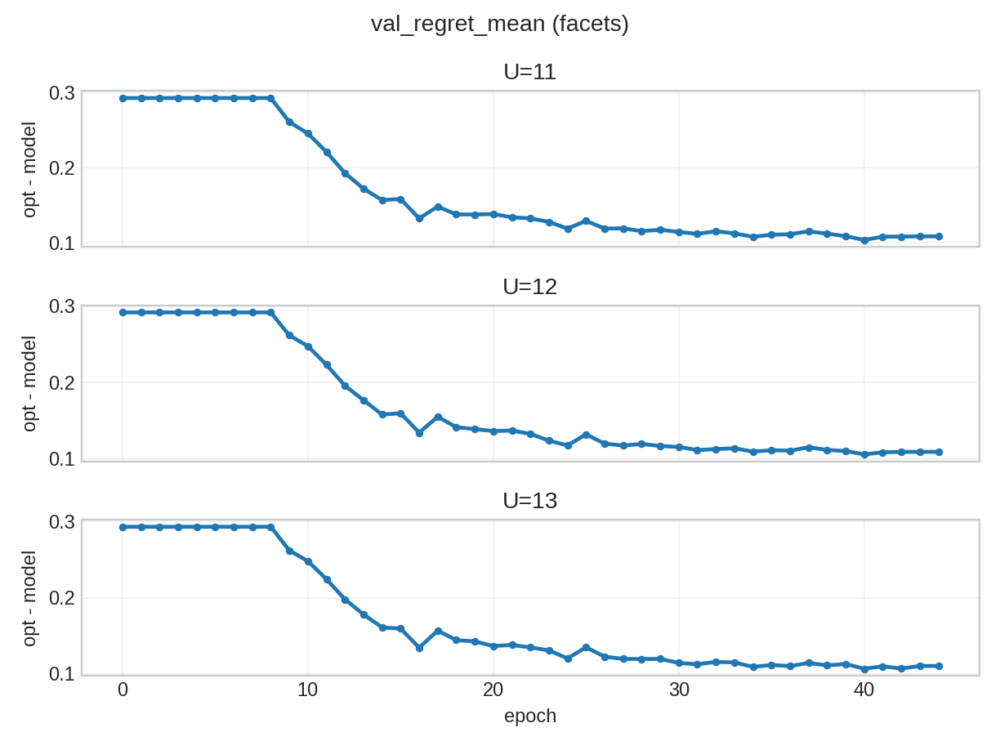

- 定义
  - $\text{regret} = J^*(s) - J^{\pi}(s)$
- 理想水平/趋势
  - 越接近 0 越好，并随 epoch 下降。
- 图的意义
  - 直接量化“离最优差多少”（绝对差值），便于对比不同实验。

> 备注：regret 是“绝对差距”，不同数据集/归一化下数值尺度会变化，所以它更适合**同一数据集上的实验对比**；
> 若要跨实验/跨数据集更可比，优先看 gap 或 ratio。

---

## 5) `val_season_acc_by_u.png`（逐赛季动作命中率，按 U 分组，仅作补充）

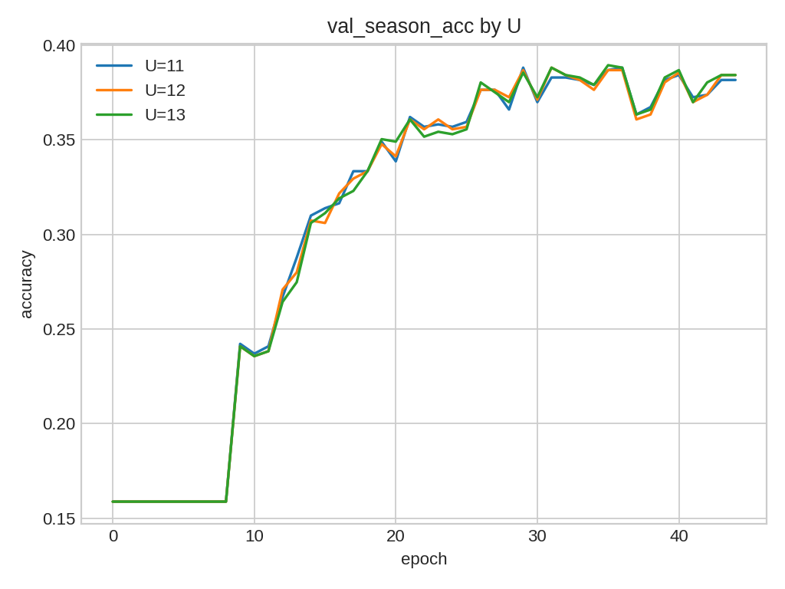

- 定义
  - 把每个样本的每个赛季动作（mask）与 DP 最优动作逐赛季对比，计算整体准确率。
- 理想水平/趋势
  - 随 epoch 上升；越高越好。
  - 但它不必到 100%：因为 DP 最优可能存在**多解**，严格动作匹配率会天然偏低。
- 图的意义
  - 反映模型是否学会“逐赛季做出与最优一致的选择”。
  - 与 gap 结合看：
    - acc 高且 gap 低：模型基本复现最优策略；
    - acc 不高但 gap 低：模型可能学到另一条近似最优路径（或 DP 多解导致“没对上那条”）；
    - acc 高但 gap 高：说明匹配到了动作但回报计算/rollout 过程存在偏差（应进一步排查）。

---

## 6) `val_allseason_acc_by_u.png`（全赛季序列完全匹配率，按 U 分组，仅作补充）

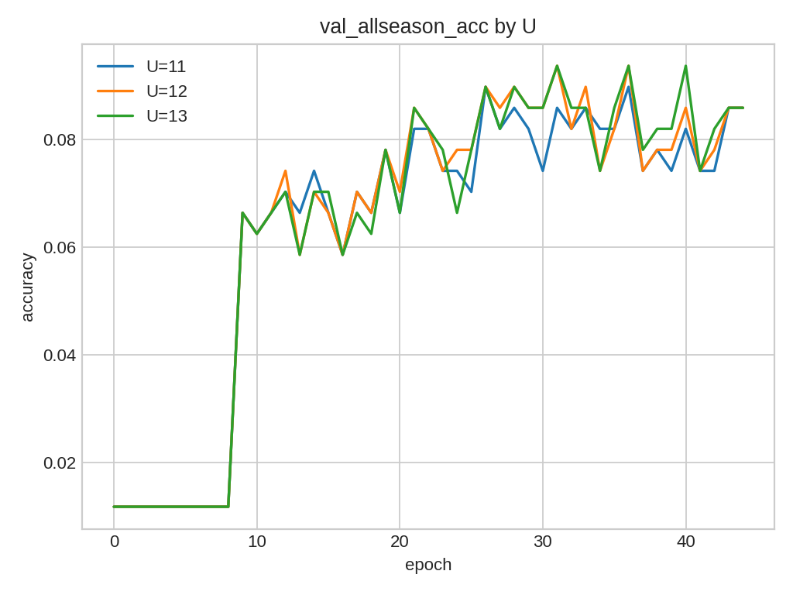

- 定义
  - 对每个样本，只有当 T 个赛季的动作序列全部与 DP 最优序列一致时，才算 1，否则 0。
- 理想水平/趋势
  - 随 epoch 上升；通常会显著低于逐赛季 acc（因为这是更严格的指标）。
- 图的意义
  - 衡量模型能否学到“跨赛季一致的最优规划”（而不仅是每季局部相似）。
  - 对 MDP 问题尤其关键：一个赛季的偏差会影响后续 churn 与收益。

---

## 备注：如何生成这些图

- 从已有 run 目录生成这些曲线（无需重训；直接用训练时记录的 `metrics.jsonl`）：

```bash
PYTHONPATH=src ./.venv/bin/python - <<'PY'
from pathlib import Path
from mcm_2026_d.nn.plots import plot_metrics

run_dir = Path('datasets/nn_runs/ab3b_constraint_shadow_cost_critic_adam_lrsmall_es8_e100_bs32')
metrics = run_dir / 'metrics.jsonl'
plot_metrics(metrics, run_dir, subdir='plots')
print('Wrote plots ->', run_dir / 'plots')
PY

# 把图片导出到 docs/figures（推荐；同时可清理中间权重）
PYTHONPATH=src ./.venv/bin/python -m mcm_2026_d cleanup-nn-run --run-dir datasets/nn_runs/ab3b_constraint_shadow_cost_critic_adam_lrsmall_es8_e100_bs32
PYTHONPATH=src ./.venv/bin/python -m mcm_2026_d export-nn-run \
  --run-dir datasets/nn_runs/ab3b_constraint_shadow_cost_critic_adam_lrsmall_es8_e100_bs32 \
  --out-dir docs/figures/nn/ab3b_constraint_shadow_cost_critic_adam_lrsmall_es8_e100_bs32
```

> 如果你想要“逐 checkpoint 复跑评估”那种图（`eval-run-nn`），需要在清理中间权重前保留中间 checkpoint。
> 推荐流程：训练结束后先跑一次 `eval-run-nn`（可加 `--topk 10`），生成 `run_eval_metrics.jsonl` 与 `plots_eval/`，然后再运行 `cleanup-nn-run`。

输出：

- `datasets/nn_runs/<run>/run_eval_metrics.jsonl`：评估曲线数据
- `datasets/nn_runs/<run>/plots_eval/*.png`：评估折线图（原始位置）
- `docs/figures/nn/<run>/train/*.png`：训练过程曲线（含 loss；来自 metrics.jsonl）
- `docs/figures/nn/<run>/eval/*.png`：逐 checkpoint 评估曲线（来自 run_eval_metrics.jsonl）
- `datasets/nn_runs/<run>/val_opt_u{U}.jsonl`：验证集 DP 最优缓存
