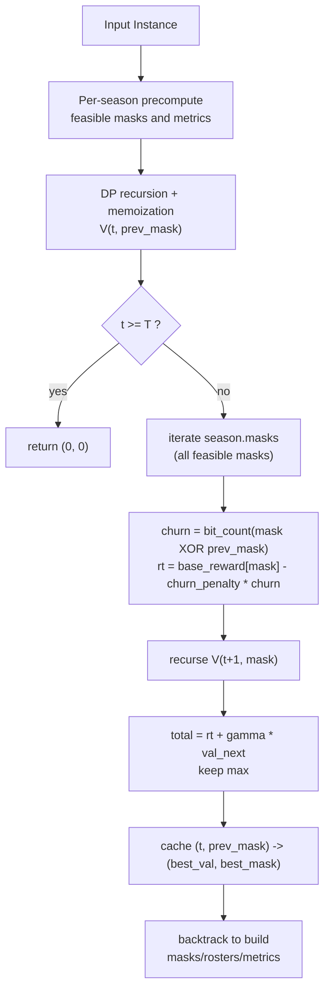
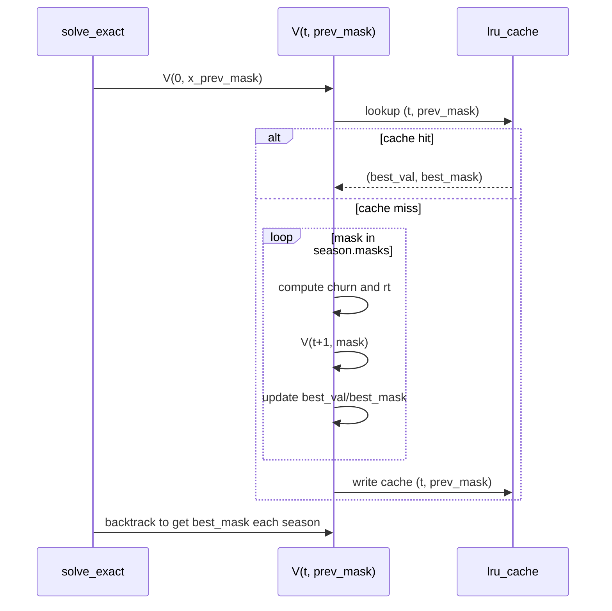
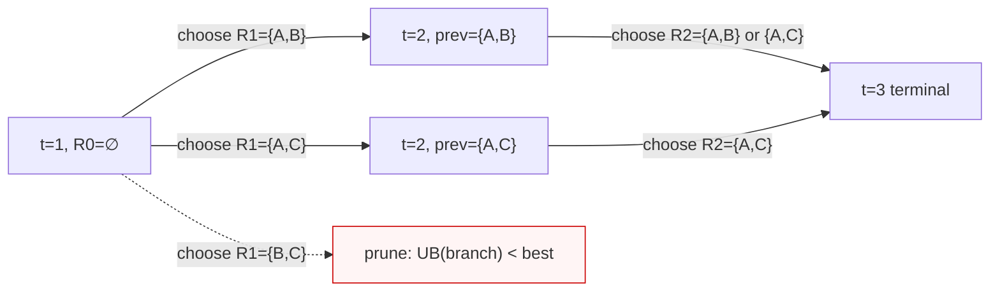

# Exact Solving for Small-Scale Roster Optimization (and Practical Speedups)

## Problem recap

For a WNBA team over a planning horizon $t=1,\dots,T$, we choose a season roster under a salary cap $C_t$ and roster size bounds $L,U$, to maximize the discounted total reward:

$$
\max_{\{\mathbf{x}_t\}_{t=1}^{T}} \sum_{t=1}^{T} \gamma^{t-1}\, r_t(\mathbf{x}_t, \mathbf{x}_{t-1}).
$$

Here $\mathbf{x}_t \in \{0,1\}^{|\mathcal{I}|}$ is the roster decision in season $t$, and $\mathbf{x}_{t-1}$ is the previous-season roster. The immediate reward $r_t$ follows the objective decomposition described in Chapters 5–8 of the problem statement (aggregate player abilities to team strength $Q_t$, compute win probability $p_t$, then wins $W_t$ and profit $\Pi_t$).

Constraints:

- **Roster size**: $L \le \sum_i x_{i,t} \le U$
- **Salary cap**: $\sum_i c_{i,t}x_{i,t} \le C_t$

When the candidate player count is small (e.g., at most 15) and the horizon is short (e.g., $T\le 3$), we can enumerate all feasible rosters and compute the globally optimal solution via dynamic programming.

## Exact algorithm (as implemented): per-season enumeration + memoized DP

The “traditional/exact solver” in this repo represents rosters as bitmasks. For each season it precomputes core metrics for all feasible rosters, then runs a cached recursive DP to find the global optimum. See [src/mcm_2026_d/solver.py](src/mcm_2026_d/solver.py).

### 1) Roster representation: bitmask

Let the number of candidate players be $n$ (in code: `inst.n_players`). A roster $\mathbf{x}_t\in\{0,1\}^n$ is represented by an integer `mask`:

- The $i$-th bit is 1 if player $i$ is selected.
- Roster size is `mask.bit_count()`.
- Roster churn between consecutive seasons is computed by

$$
\mathrm{churn}(\mathbf{x}_t,\mathbf{x}_{t-1})
= \|\mathbf{x}_t-\mathbf{x}_{t-1}\|_0
= \operatorname{bit\_count}(\mathrm{mask}_t \oplus \mathrm{mask}_{t-1}).
$$

This makes “counting players / comparing rosters” constant-time via bit operations.

### 2) Per-season precomputation: push "enumerate + evaluate" upfront

For each season $t=0,\dots,T-1$, `_compute_season_precomp(inst, t)` iterates all `mask in range(1<<n)` and filters infeasible rosters:

- **Size constraint**: $L \le \operatorname{bit\_count}(mask) \le U$ (via `inst.L`, `inst.U`)
- **Cap constraint**: $\sum_i c_{i,t}x_{i,t} \le C_t$ (using `inst.salaries[t]` and `inst.C[t]`)

For each feasible `mask`, it precomputes and caches:

1. **Aggregated ability vector**: $\mathbf{u}_t = \sum_{i\in\mathrm{roster}(\mathrm{mask})} \mathbf{a}_{i,t}$
2. **Team quality**: $Q_t = \mathbf{w}^\top\mathbf{u}_t$ (`inst.w`)
3. **Win probability**: $p_t = \sigma(\beta (Q_t - Q^{opp}_t))$ (`inst.beta`, `inst.Q_opp[t]`; sigmoid in [src/mcm_2026_d/math_utils.py](src/mcm_2026_d/math_utils.py))
4. **Wins**: $W_t = G_t\,p_t$ (`inst.G[t]`)
5. **Revenue and profit**:

   $$
   \mathrm{revenue}_t = R_{base,t} + \rho_t W_t,\quad
   \mathrm{profit}_t = \mathrm{revenue}_t - \mathrm{cost}_t.
   $$

6. **Base reward (without churn penalty)**:

   $$
   \mathrm{base\_reward}_t
   = \lambda_{win}\cdot \frac{W_t}{G_t}
   + (1-\lambda_{win})\cdot\frac{\mathrm{profit}_t}{R_{base,t}}.
   $$

Item 6 matches the normalized form in [model_general.md](model_general.md) (the code explicitly references this normalization).

Here $\mathrm{roster}(\mathrm{mask})$ denotes the set of selected player indices decoded from `mask` (via `_mask_to_indices(mask, n_players)`).

### 3) DP state and transition (matching `solve_exact`)

Let `V(t, prev_mask)` denote: starting from season $t$, given that the previous-season roster is `prev_mask`, the **maximum discounted cumulative return**, along with the best roster to choose in season $t$.

- **Terminal**: if $t \ge T$, return $(0, 0)$
- **Immediate reward**:

  $$
  r_t(\mathrm{mask}_t,\mathrm{prev})
  = \mathrm{base\_reward}_t(\mathrm{mask}_t)
  - \mathrm{churn\_penalty}\cdot \mathrm{churn}(\mathrm{mask}_t,\mathrm{prev})
  $$

  where `inst.churn_penalty` is the penalty per changed player.

- **Recurrence**:

  $$
  V(t,\mathrm{prev})
  = \max_{\mathrm{mask}\in \mathcal{X}_t}\left[r_t(\mathrm{mask},\mathrm{prev}) + \gamma\,V(t+1,\mathrm{mask})\right]
  $$

The code uses `inst.gamma` for $\gamma$, and the initial previous roster is `inst.x_prev_mask`.

### 4) Why memoization (`lru_cache`) matters

Without caching, recursion recomputes the same `(t, prev_mask)` many times, leading to exponential blow-up.

The implementation uses `@lru_cache(maxsize=None)` to cache `V(t, prev_mask)`, so each state is computed once.

### 5) Backtracking: output the full policy and per-season metrics

After `objective, first_mask = V(0, x_prev_mask)`, the solver backtracks from $t=0$ by reading the cached best action for each `(t, prev)`, producing `masks`, converting to roster index lists `rosters`, and populating `SeasonMetrics(Q,p,W,cost,revenue,profit,reward)`.

### Mermaid: overall workflow and DP call structure





---

## A minimal hand-worked example: DP transitions and pruning

### Setup

- Two seasons: $t=1,2$ (for narration; code uses `t=0,1`)
- Candidate players: $\{A,B,C\}$
- Fixed roster size 2 (i.e., $L=U=2$)
- Discount: $\gamma=0.9$
- Churn penalty: $\eta=0.1$ (corresponds to `churn_penalty`)
- Initial previous roster is empty: $R_0=\varnothing$ (same semantics as `x_prev_mask=0`)

Assume per-season base rewards have already been computed and normalized into `base_reward` (this corresponds to the precompute step). We directly list them here:

| Season t | Roster $R$ | $\mathrm{base\_reward}_t(R)$ |
|---|---|---:|
| 1 | {A,B} | 1.00 |
| 1 | {A,C} | 0.80 |
| 1 | {B,C} | 0.60 |
| 2 | {A,B} | 0.70 |
| 2 | {A,C} | 0.90 |
| 2 | {B,C} | 0.65 |

Churn is the size of the symmetric difference:

$$
\mathrm{churn}(R_t,R_{t-1}) = |R_t\,\triangle\,R_{t-1}|.
$$

For example, $\mathrm{churn}(\{A,B\},\{A,C\})=|\{B,C\}|=2$.

Immediate reward (matching code) is:

$$
r_t(R_t,R_{t-1})=\mathrm{base\_reward}_t(R_t) - \eta\cdot \mathrm{churn}(R_t,R_{t-1}).
$$

### DP state and transition (set notation)

Define the value function:

$$
V(t,R_{t-1}) = \max_{R_t\in\mathcal{X}_t}\Bigl[r_t(R_t,R_{t-1}) + \gamma\,V(t+1,R_t)\Bigr],
$$

with terminal condition $V(3,\cdot)=0$ (because there are only two seasons).

Here $\mathcal{X}_t=\{\{A,B\},\{A,C\},\{B,C\}\}$.

### Season 2 (t=2): solve given previous roster

Because $V(3,\cdot)=0$,

$$
V(2,R_1)=\max_{R_2}\ r_2(R_2,R_1).
$$

1) If $R_1=\{A,B\}$:

- Choose $R_2=\{A,B\}$: churn=0, $r_2=0.70$
- Choose $R_2=\{A,C\}$: churn=2, $r_2=0.90-0.2=0.70$
- Choose $R_2=\{B,C\}$: churn=2, $r_2=0.65-0.2=0.45$

So $V(2,\{A,B\})=0.70$ (either {A,B} or {A,C} is optimal).

1) If $R_1=\{A,C\}$:

- Choose $R_2=\{A,C\}$: churn=0, $r_2=0.90$
- Choose $R_2=\{A,B\}$: churn=2, $r_2=0.70-0.2=0.50$
- Choose $R_2=\{B,C\}$: churn=2, $r_2=0.65-0.2=0.45$

So $V(2,\{A,C\})=0.90$ (unique optimum is to keep {A,C}).

1) If $R_1=\{B,C\}$:

- Choose $R_2=\{A,C\}$: churn=2, $r_2=0.90-0.2=0.70$
- Choose $R_2=\{A,B\}$: churn=2, $r_2=0.70-0.2=0.50$
- Choose $R_2=\{B,C\}$: churn=0, $r_2=0.65$

So $V(2,\{B,C\})=0.70$ (best is to move to {A,C}).

### Season 1 (t=1): choose first-season roster plus future value

Initial previous roster is empty: $R_0=\varnothing$.

For any 2-player roster $R_1$, we have $\mathrm{churn}(R_1,\varnothing)=2$, so

$$
r_1(R_1,\varnothing)=\mathrm{base\_reward}_1(R_1)-0.2.
$$

Evaluate three branches:

1) Choose $R_1=\{A,B\}$:

$$
\underbrace{r_1}_{0.8} + \gamma\underbrace{V(2,\{A,B\})}_{0.70}
=0.8+0.9\times 0.70
=1.43.
$$

1) Choose $R_1=\{A,C\}$:

$$
\underbrace{r_1}_{0.6} + 0.9\times \underbrace{V(2,\{A,C\})}_{0.90}
=0.6+0.81
=1.41.
$$

1) Choose $R_1=\{B,C\}$:

$$
\underbrace{r_1}_{0.4} + 0.9\times \underbrace{V(2,\{B,C\})}_{0.70}
=0.4+0.63
=1.03.
$$

Therefore the optimal policy is: choose {A,B} in season 1, with total value $V(1,\varnothing)=1.43$.

### A simple pruning demo: branch-and-bound

To illustrate pruning, suppose we enumerate first-season rosters in order {A,B} → {A,C} → {B,C}.

After evaluating the {A,B} branch, we have an incumbent best value: $\mathrm{best}=1.43$.

Before expanding the {B,C} branch fully, compute an optimistic upper bound:

- We know the first-season immediate reward is $r_1(\{B,C\},\varnothing)=0.4$.
- For the season-2 future part, the most optimistic case is to assume we can obtain the maximum base reward with zero churn penalty:

  $$
  \max_R \mathrm{base\_reward}_2(R)=0.90.
  $$

  Thus future upper bound $\le 0.9\times 0.90=0.81$.

So the branch upper bound is

$$
\mathrm{UB} = 0.4 + 0.81 = 1.21 < 1.43 = \mathrm{best}.
$$

Therefore the {B,C} branch can be pruned without exploring season 2.

### A tiny state transition tree (with pruning)



---

## Complexity and applicability (based on current implementation)

Assume $n\le 15$. Per-season enumeration/precompute cost is roughly:

- Precompute: $\mathcal{O}(T\cdot 2^n)$ (the code explicitly notes “n<=15 is acceptable”)

The number of DP states is approximately the number of possible `prev_mask` values, which is typically close to the number of feasible rosters $|\mathcal{X}_t|$. The main DP cost can be approximated by:

- DP: $\sum_t \mathcal{O}(|\mathcal{X}_{t-1}|\cdot |\mathcal{X}_t|)$, and if sizes are similar across seasons, $\mathcal{O}(T\cdot |\mathcal{X}|^2)$

This explains why the approach is suited for small $n$ and small $T$: it yields **strictly optimal** solutions, ideal for producing high-quality labels (e.g., supervised signals for neural training).

---

## Further optimizations (optional; not enabled in current `solver.py`)

The following are standard speedup ideas **without sacrificing optimality**. They are not currently implemented in [src/mcm_2026_d/solver.py](src/mcm_2026_d/solver.py), but are valuable if you want to scale the exact solver further.

### 1. Dominance pruning (Pareto frontier)

When generating feasible rosters, prune dominated rosters. If two rosters $\mathbf{x}$ and $\mathbf{y}$ satisfy:

- $\sum_i c_{i,t} x_i \ge \sum_i c_{i,t} y_i$ (roster $\mathbf{y}$ is cheaper or equal), and
- $\mathbf{u}_t(\mathbf{x}) \preceq \mathbf{u}_t(\mathbf{y})$ (ability vector is no better in every dimension),

then $\mathbf{x}$ is dominated by $\mathbf{y}$ and can be removed from $\mathcal{X}_t$ without affecting the optimum. Keeping only the **Pareto frontier** can shrink search significantly.

### 2. Upper bounds and branch-and-bound

During recursion, compute an optimistic upper bound $U(t,\mathbf{p})$ for each partial solution $\mathbf{p}$. If current accumulated reward plus $U(t,\mathbf{p})$ is still below the incumbent best, stop expanding that branch.

Upper bounds can be constructed in a simple way by assuming that in all remaining seasons we can achieve the maximum possible reward (e.g., by selecting a “perfect” roster).

### 3. Pre-sorting and heuristic initialization

Although we still enumerate all feasible rosters in principle, we can sort $\mathcal{X}_t$ by a proxy value (e.g., linear score of $\mathbf{u}_t$ or ability/cost ratio) so high-value branches are found early. This improves pruning effectiveness.

You can also initialize with a greedy or heuristic solution to obtain a strong incumbent early, further boosting pruning.

### 4. Bit operations and caching

Bitmasks reduce memory and accelerate set operations. Precomputing per-mask costs, aggregated abilities, and rewards enables fast DP lookup. Efficient hashing and `lru_cache` caching reduce repeated computation.

---

## Summary

The current exact DP solver has two core properties:

1. **Precompute per-season roster evaluation** (`PrecompSeason`), avoiding repeated win/profit calculations inside DP.
2. **Bitmask + `lru_cache`** transforms multi-season global search into a finite-state optimal-substructure DP, guaranteeing exact optimality.

Under small-scale settings (e.g., $n\le 15,\ T\le 3$), it is useful both for studying optimal-policy structure and for generating high-quality supervised labels.

---

## Implementation and data export (ready-to-run)

This repo includes an end-to-end pipeline: generate synthetic instances, solve each instance exactly with DP, and export datasets.

- Exact solver: [src/mcm_2026_d/solver.py](src/mcm_2026_d/solver.py)
- Synthetic instance generation: [src/mcm_2026_d/generate.py](src/mcm_2026_d/generate.py)
- Dataset export (JSONL): [src/mcm_2026_d/dataset.py](src/mcm_2026_d/dataset.py)
- CLI entry: [src/mcm_2026_d/cli.py](src/mcm_2026_d/cli.py)

### Environment and running

From the repository root:

```bash
uv sync

# Generate N samples, solve each with exact DP, and export:
mcm2026d generate-and-solve \
   --out datasets/pairs.jsonl \
   --out-instances datasets/instances.jsonl \
   --out-solutions datasets/solutions.jsonl \
   --out-summary datasets/summary.csv \
   --n 200 --seed 0
```

> If your shell does not include `.venv/bin` on `PATH`, you can use `./.venv/bin/mcm2026d ...` or `uv run mcm2026d ...`.

Exported files:

- `datasets/pairs.jsonl`: each line contains `instance` and its `solution` (recommended for training)
- `datasets/instances.jsonl`: inputs only
- `datasets/solutions.jsonl`: optimal solutions only
- `datasets/summary.csv`: quick sanity-check summary

### Scraping real data (Basketball-Reference WNBA)

Fetch/cache BRef WNBA yearly advanced pages and build reusable player pools:

```bash
mcm2026d scrape-bref \
   --years 2022 --years 2023 --years 2024 \
   --min-mp 200
```

Example output: `data/raw/bref/pool/pool_2022.csv` (one row per player with features and minutes).

### Mixed real + synthetic dataset

Based on the real player pools, generate mixed small-scale instances and solve them exactly:

```bash
mcm2026d generate-and-solve-mixed \
   --out datasets/pairs_mixed_2000.jsonl \
   --pool-dir data/raw/bref/pool \
   --years 2022 --years 2023 --years 2024 \
   --real-frac 0.7 \
   --n 2000 --seed 1 \
   --n-players 15 --t 3 --k 6 --l 11 --u 12
```

`--real-frac` controls the fraction of samples drawn from the real player pool; the other parameters match the synthetic generator.
