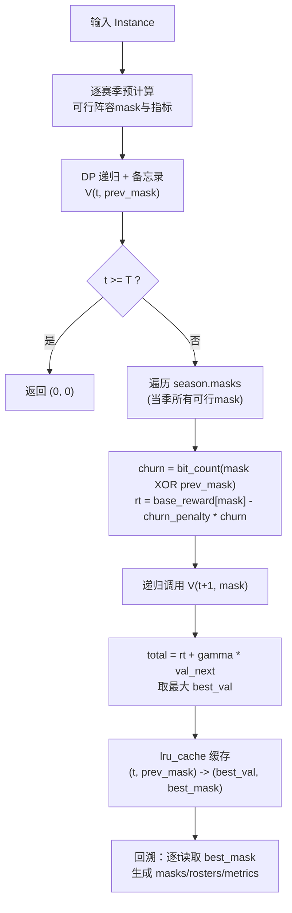
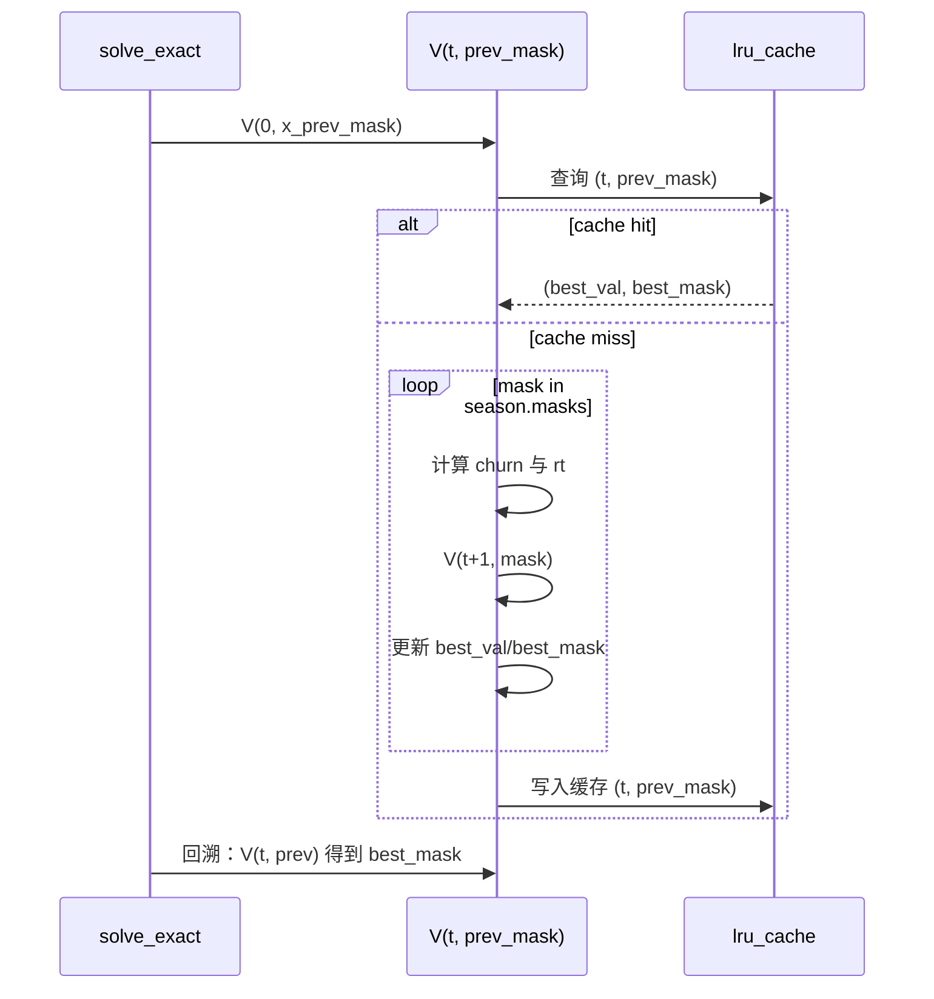
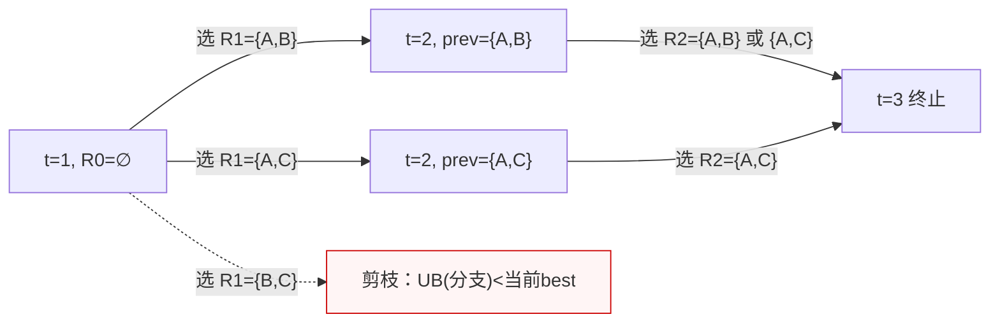

# 小规模阵容优化的精确求解与性能优化

## 问题回顾

给定一支 WNBA 球队在规划期 $t=1,\dots,T$ 内的阵容选择，需在满足工资帽 $C_t$ 及阵容规模上下限 $L,U$ 的约束下，最大化折扣总奖励：
$$
\max_{\{\mathbf{x}_t\}_{t=1}^{T}} \sum_{t=1}^{T} \gamma^{t-1}\, r_t(\mathbf{x}_t, \mathbf{x}_{t-1}).
$$
其中 $\mathbf{x}_t \in \{0,1\}^{|\mathcal{I}|}$ 表示第 $t$ 赛季的阵容决策，$\mathbf{x}_{t-1}$ 为上一赛季阵容；即时奖励 $r_t$ 由第 5–8 章给出的公式确定（聚合球员能力得到球队实力 $Q_t$，计算胜率 $p_t$，进而得到胜场 $W_t$ 和利润 $\Pi_t$）。

约束包括：

* **阵容规模约束**：$L \le \sum_i x_{i,t} \le U$；
* **工资帽约束**：$\sum_i c_{i,t} \, x_{i,t} \le C_t$。

对于球员总数较小（例如可选球员不超过 15 人），赛季数较短（$T\le 3$）的情况，可以通过枚举所有可行阵容并使用动态规划获得全局最优解。

## 精确算法（以代码为准）：逐赛季穷举 + 备忘录DP

本仓库的“传统解法/精确求解器”以位掩码（bitmask）表示阵容，并在每个赛季预计算所有可行阵容的核心指标，然后用带缓存的递归DP求全局最优。实现见 [src/mcm_2026_d/solver.py](src/mcm_2026_d/solver.py)。

### 1) 阵容表示：位掩码（mask）

设候选球员数为 $n$（代码里为 `inst.n_players`）。一个阵容 $\mathbf{x}_t\in\{0,1\}^n$ 在实现中用一个整数 `mask` 表示：

* `mask` 的第 $i$ 位为 1 表示选择球员 $i$；为 0 表示不选。
* 阵容规模 $|\mathbf{x}_t|$ 用 `mask.bit_count()` 得到。
* 两赛季阵容变化人数（代码中的 churn）用
  $$
   \mathrm{churn}(\mathbf{x}_t,\mathbf{x}_{t-1})
   = \|\mathbf{x}_t - \mathbf{x}_{t-1}\|_0
   = \operatorname{bit\_count}(\mathrm{mask}_t \oplus \mathrm{mask}_{t-1}).
  $$

这使得“统计人数/比较阵容变化”都能用常数时间的位运算完成。

### 2) 单赛季预计算：把“枚举 + 评价”前置

对每个赛季 $t=0,\dots,T-1$，函数 `_compute_season_precomp(inst, t)` 会遍历所有 `mask in range(1<<n)`，并筛掉不满足约束的阵容：

* **规模约束**：$L \le \operatorname{bit\_count}(mask) \le U$（`inst.L`, `inst.U`）
* **工资帽约束**：$\sum_i c_{i,t} x_{i,t} \le C_t$（`inst.salaries[t]` 与 `inst.C[t]`）

对每个可行 `mask`，代码会预先计算并缓存：

1. **聚合能力向量**：$\mathbf{u}_t = \sum_{i\in\mathrm{roster}(\mathrm{mask})} \mathbf{a}_{i,t}$
2. **球队质量**：$Q_t = \mathbf{w}^\top\mathbf{u}_t$（`inst.w`）
3. **胜率**：$p_t = \sigma(\beta (Q_t - Q^{opp}_t))$（`inst.beta`, `inst.Q_opp[t]`，`sigmoid` 在 [src/mcm_2026_d/math_utils.py](src/mcm_2026_d/math_utils.py)）
4. **胜场**：$W_t = G_t\,p_t$（`inst.G[t]`）
5. **收入与利润**：
   $$
   \mathrm{revenue}_t = R_{base,t} + \rho_t W_t,\quad
   \mathrm{profit}_t = \mathrm{revenue}_t - \mathrm{cost}_t.
   $$
6. **基础奖励（不含阵容变化惩罚）**：
   $$
   \mathrm{base\_reward}_t
   = \lambda_{win}\cdot \frac{W_t}{G_t}
   + (1-\lambda_{win})\cdot\frac{\mathrm{profit}_t}{R_{base,t}}.
   $$

其中第 6 点与仓库的 `model_general.md` 归一化写法保持一致（代码里注释为 “按 model_general.md 的归一化写法”）。

这里的 $\mathrm{roster}(\mathrm{mask})$ 表示由 `mask` 解码出的球员下标集合（代码中通过 `_mask_to_indices(mask, n_players)` 得到）。

### 3) DP状态与转移（与 `solve_exact` 一致）

DP 用函数 `V(t, prev_mask)` 表示：从赛季 $t$ 开始、上一赛季阵容为 `prev_mask` 时，能够获得的**最大折扣累计回报**，同时返回“本赛季应选择的最优阵容”。

* **终止条件**：当 $t \ge T$，返回 $(0, 0)$
* **即时回报**：
  $$
   r_t(\mathrm{mask}_t,\mathrm{prev})
   = \mathrm{base\_reward}_t(\mathrm{mask}_t)
   - \mathrm{churn\_penalty}\cdot \mathrm{churn}(\mathrm{mask}_t,\mathrm{prev}).
  $$
  其中 `inst.churn_penalty` 为每“换一个球员”扣的惩罚。
* **递归转移**：
  $$
   V(t,\mathrm{prev})
   = \max_{\mathrm{mask}\in \mathcal{X}_t}\left[r_t(\mathrm{mask},\mathrm{prev}) + \gamma\,V(t+1,\mathrm{mask})\right]
  $$
  并记录实现最大值的 `best_mask`。

注意：代码里 `gamma`（折扣因子）是 `inst.gamma`，上一赛季初始阵容由 `inst.x_prev_mask` 给定。

### 4) 为什么需要备忘录（`lru_cache`）

如果不缓存，递归会反复计算同一个 `(t, prev_mask)`，开销会呈指数级爆炸。

代码使用 `@lru_cache(maxsize=None)` 缓存 `V(t, prev_mask)` 的结果，将重复子问题合并成“每个状态计算一次”。

### 5) 回溯：输出完整策略与每季指标

求得 `objective, first_mask = V(0, x_prev_mask)` 后，代码会从 `t=0` 起逐季读取 `V(t, prev)` 返回的 `best_mask`，形成 `masks`；再将每个 `mask` 转换为球员下标列表 `rosters`，并填充 `SeasonMetrics(Q,p,W,cost,revenue,profit,reward)`。

### Mermaid 图：整体流程与DP调用关系





## 一个最小“手算”例子：演示 DP 状态转移与剪枝

### 例子设定

* 两个赛季：$t=1,2$（为了叙述方便，这里用 1/2；代码里对应 `t=0/1`）
* 候选球员：$\{A,B,C\}$
* 阵容规模固定为 2 人（即 $L=U=2$）
* 折扣因子：$\gamma=0.9$
* 换人惩罚：$\eta=0.1$（对应代码里的 `churn_penalty`）
* 上一季初始阵容为空：$R_0=\varnothing$（对应 `x_prev_mask=0` 的语义）

对每个赛季，我们假设已经把“球队实力/胜率/利润”等都算完并归一化成了 `base_reward`（这一步对应代码里的单赛季预计算）。因此这里直接给出每个可行阵容在每季的基础奖励：

| 赛季 t | 阵容 $R$ | $\mathrm{base\_reward}_t(R)$ |
|---|---|---:|
| 1 | {A,B} | 1.00 |
| 1 | {A,C} | 0.80 |
| 1 | {B,C} | 0.60 |
| 2 | {A,B} | 0.70 |
| 2 | {A,C} | 0.90 |
| 2 | {B,C} | 0.65 |

换人数量（churn）用集合的对称差大小表示：
$$
\mathrm{churn}(R_t,R_{t-1}) = |R_t\,\triangle\,R_{t-1}|.
$$
例如 $\mathrm{churn}(\{A,B\},\{A,C\})=|\{B,C\}|=2$。

每季即时回报（与代码一致）为：
$$
r_t(R_t,R_{t-1})=\mathrm{base\_reward}_t(R_t) - \eta\cdot \mathrm{churn}(R_t,R_{t-1}).
$$

### DP 状态与转移（用集合写）

定义值函数：
$$
V(t,R_{t-1}) = \max_{R_t\in\mathcal{X}_t}\Bigl[r_t(R_t,R_{t-1}) + \gamma\,V(t+1,R_t)\Bigr],
$$
终止条件：$V(3,\cdot)=0$（因为只有两个赛季）。

这里 $\mathcal{X}_t=\{\{A,B\},\{A,C\},\{B,C\}\}$。

### 第 2 季（t=2）先手算：给定上一季阵容，选本季最优

因为 $V(3,\cdot)=0$，所以
$$
V(2,R_1)=\max_{R_2}\ r_2(R_2,R_1).
$$

1) 若 $R_1=\{A,B\}$：

* 选 $R_2=\{A,B\}$：churn=0，$r_2=0.70$
* 选 $R_2=\{A,C\}$：churn=2，$r_2=0.90-0.2=0.70$
* 选 $R_2=\{B,C\}$：churn=2，$r_2=0.65-0.2=0.45$

所以 $V(2,\{A,B\})=0.70$（可选 {A,B} 或 {A,C} 都最优）。

1) 若 $R_1=\{A,C\}$：

* 选 $R_2=\{A,C\}$：churn=0，$r_2=0.90$
* 选 $R_2=\{A,B\}$：churn=2，$r_2=0.70-0.2=0.50$
* 选 $R_2=\{B,C\}$：churn=2，$r_2=0.65-0.2=0.45$

所以 $V(2,\{A,C\})=0.90$（唯一最优是保持 {A,C}）。

1) 若 $R_1=\{B,C\}$：

* 选 $R_2=\{A,C\}$：churn=2，$r_2=0.90-0.2=0.70$
* 选 $R_2=\{A,B\}$：churn=2，$r_2=0.70-0.2=0.50$
* 选 $R_2=\{B,C\}$：churn=0，$r_2=0.65$

所以 $V(2,\{B,C\})=0.70$（最优转到 {A,C}）。

### 第 1 季（t=1）再手算：选择首季阵容并加上未来价值

初始上一季为空：$R_0=\varnothing$。

对任意 2 人阵容 $R_1$，都有 $\mathrm{churn}(R_1,\varnothing)=2$，所以首季即时回报是
$$
r_1(R_1,\varnothing)=\mathrm{base\_reward}_1(R_1)-0.2.
$$

分别计算三条分支（这就是 DP 的“状态转移”）：

1) 选 $R_1=\{A,B\}$：

$$
\underbrace{r_1}_{0.8} + \gamma\underbrace{V(2,\{A,B\})}_{0.70}
=0.8+0.9\times 0.70
=1.43.
$$

1) 选 $R_1=\{A,C\}$：

$$
\underbrace{r_1}_{0.6} + 0.9\times \underbrace{V(2,\{A,C\})}_{0.90}
=0.6+0.81
=1.41.
$$

1) 选 $R_1=\{B,C\}$：

$$
\underbrace{r_1}_{0.4} + 0.9\times \underbrace{V(2,\{B,C\})}_{0.70}
=0.4+0.63
=1.03.
$$

因此最优策略是：第 1 季选 {A,B}，总目标值 $V(1,\varnothing)=1.43$。

### 在这个例子里演示一个“剪枝”：分支限界（Branch-and-Bound）

为了演示剪枝，我们假设按顺序枚举首季候选阵容：{A,B} → {A,C} → {B,C}。

当我们已经算完 {A,B} 分支后，得到当前最好值（incumbent）：$\mathrm{best}=1.43$。

现在准备评估 {B,C} 分支，但我们可以先算一个“乐观上界”来决定要不要继续深入：

* 已知首季即时回报 $r_1(\{B,C\},\varnothing)=0.4$
* 对第 2 季的未来部分，最乐观的情况是假设可以拿到当季的最大基础奖励且不付任何换人惩罚：
  $$
  \max_R \mathrm{base\_reward}_2(R)=0.90.
  $$
  因此未来上界 $\le 0.9\times 0.90=0.81$

于是该分支的总上界：
$$
\mathrm{UB} = 0.4 + 0.81 = 1.21 < 1.43 = \mathrm{best}.
$$
因此 {B,C} 这个分支可以直接剪掉（无需再展开第 2 季的选择）。

这就是“剪枝”的核心逻辑：用一个保证不低估最优值的上界，提前排除不可能超过当前最好解的分支。

### 用集合状态画一棵很小的状态转移树（含剪枝）



## 复杂度与适用范围（按当前实现估算）

设球员数 $n\le 15$，每赛季枚举所有 `mask` 的预计算开销约为：

* 预计算：$\mathcal{O}(T\cdot 2^n)$（代码中明确写了 “n<=15, 可接受”）

DP 的状态数大致为“每个赛季可能出现的 `prev_mask` 数量”，通常近似为可行阵容数 $|\mathcal{X}_t|$。因此 DP 的主要开销可近似看成：

* DP：$\sum_t \mathcal{O}(|\mathcal{X}_{t-1}|\cdot |\mathcal{X}_t|)$，若各赛季规模相近为 $\mathcal{O}(T\cdot |\mathcal{X}|^2)$

这也是该方法适用于 $n$、$T$ 都较小的原因：它能给出“严格最优”解，适合做高质量标注数据（例如训练神经网络的监督信号）。

## 进一步优化（可选；当前 solver.py 未启用）

下面列的是“在保持最优性前提下”的典型加速思路：它们在当前 [src/mcm_2026_d/solver.py](src/mcm_2026_d/solver.py) 中并未实现，但如果你后续希望把精确求解扩到更大规模，这些会很有价值。

### 1. 剪枝：支配关系筛选（帕累托前沿）

在生成可行阵容集合时，可依据**支配关系**过滤劣势阵容。如果存在两份阵容 $\mathbf{x}$ 和 $\mathbf{y}$，满足：

* $\sum_i c_{i,t} x_i \ge \sum_i c_{i,t} y_i$（$\mathbf{y}$ 成本更低或相等），且
* $\mathbf{u}_t(\mathbf{x}) \preceq \mathbf{u}_t(\mathbf{y})$（能力向量每个维度均不超过 $\mathbf{y}$），

则 $\mathbf{x}$ 在成本和能力上均被 $\mathbf{y}$ 支配，不可能产生更好回报，可将 $\mathbf{x}$ 从 $\mathcal{X}_t$ 中剔除。通过保留 **帕累托前沿**（Pareto frontier）的阵容，可大幅缩减搜索空间，同时不影响最优解。

### 2. 上界估计与分支限界（Branch-and-Bound）

在递归过程中，对每个部分解计算一个**乐观上界** $U(t,\mathbf{p})$，代表在当前已选 $\mathbf{p}$ 且接下来赛季都能获得最大可能奖励的假设下，理论上能达到的最大折扣收益。若某条分支的当前累计奖励加上上界 $U(t,\mathbf{p})$ 仍不及已知最佳解，则该分支不再深入。这一“分支限界”（branch‑and‑bound）策略可以有效裁剪大量不可能的组合。

构造上界的方法可以简单地假设未来每个赛季都选择理论上的完美阵容（例如选择能力向量各维度最大值之和）获得的最大可能奖励。

### 3. 预排序与启发式初始化

虽然优化过程最终仍要穷举所有可行阵容，但可以提前对 $\mathcal{X}_t$ 按潜在价值排序（例如按照 $\mathbf{u}_t$ 的线性评分或单位能力/成本比排序），使得算法更快发现高价值方案并更新当前最佳值，从而结合上界剪枝起到更强的效果。

此外，可以先使用贪婪算法或简单启发式（如按能力/成本比率挑选阵容）得到一个较好的初始解，将其作为初始最佳值。这有助于剪枝算法尽早排除价值较低的组合。

### 4. 位运算和缓存优化

用位掩码表示阵容（比如一个整数的每一位代表一名球员是否入选），可以大幅减少内存占用并加速集合操作。预先计算每个掩码对应的成本、聚合能力以及在各赛季的即时奖励，有助于在递归时快速检索。利用高效的哈希表或 `lru_cache` 缓存递归结果也能降低重复计算。

## 小结

当前实现的精确DP求解器有两个核心特点：

1. **把每赛季的“阵容评价”预计算**（`PrecompSeason`），避免DP内重复计算胜率/收益等公式。
2. **用位掩码 + `lru_cache`** 将多赛季全局搜索变成“有限状态的最优子结构问题”，保证严格最优。

在小规模设定（如 $n\le 15,\ T\le 3$）下，它既可用于研究“最优策略的结构”，也可作为生成监督训练数据的高质量标签来源。

---

## 代码实现与数据导出（已跑通）

本仓库已给出可直接运行的“合成实例生成 + 精确DP最优解 + 数据导出”流水线：

* 精确求解器实现： [src/mcm_2026_d/solver.py](src/mcm_2026_d/solver.py)
* 合成数据生成： [src/mcm_2026_d/generate.py](src/mcm_2026_d/generate.py)
* 数据集导出（JSONL）： [src/mcm_2026_d/dataset.py](src/mcm_2026_d/dataset.py)
* 命令行入口： [src/mcm_2026_d/cli.py](src/mcm_2026_d/cli.py)

### 环境与运行

在仓库根目录：

```bash
uv sync

# 生成 N 个样本，逐个用精确DP求最优解，并导出：
mcm2026d generate-and-solve \
   --out datasets/pairs.jsonl \
   --out-instances datasets/instances.jsonl \
   --out-solutions datasets/solutions.jsonl \
   --out-summary datasets/summary.csv \
   --n 200 --seed 0
```

> 如果你的 shell 没有把 `.venv/bin` 加入 PATH，也可以用 `./.venv/bin/mcm2026d ...` 或 `uv run mcm2026d ...`。

导出文件说明：

* `datasets/pairs.jsonl`：每行包含 `instance` 与其对应的 `solution`（推荐用于训练，输入/标签同存一行）
* `datasets/instances.jsonl`：仅输入
* `datasets/solutions.jsonl`：仅最优解
* `datasets/summary.csv`：快速检查用的汇总表

### 真实数据抓取（Basketball-Reference WNBA）

抓取/缓存 BRef WNBA 年度 advanced 页面，并生成可复用的球员特征池：

```bash
mcm2026d scrape-bref \
   --years 2022 --years 2023 --years 2024 \
   --min-mp 200
```

输出示例：`data/raw/bref/pool/pool_2022.csv`（每行一个球员的特征与分钟）。

### 真实+合成混合数据集

在“真实球员池”基础上，混合生成小规模实例，并用精确DP求最优解导出训练对：

```bash
mcm2026d generate-and-solve-mixed \
   --out datasets/pairs_mixed_2000.jsonl \
   --pool-dir data/raw/bref/pool \
   --years 2022 --years 2023 --years 2024 \
   --real-frac 0.7 \
   --n 2000 --seed 1 \
   --n-players 15 --t 3 --k 6 --l 11 --u 12
```

`--real-frac` 控制“使用真实球员池”的样本比例；其余参数与合成版一致。
