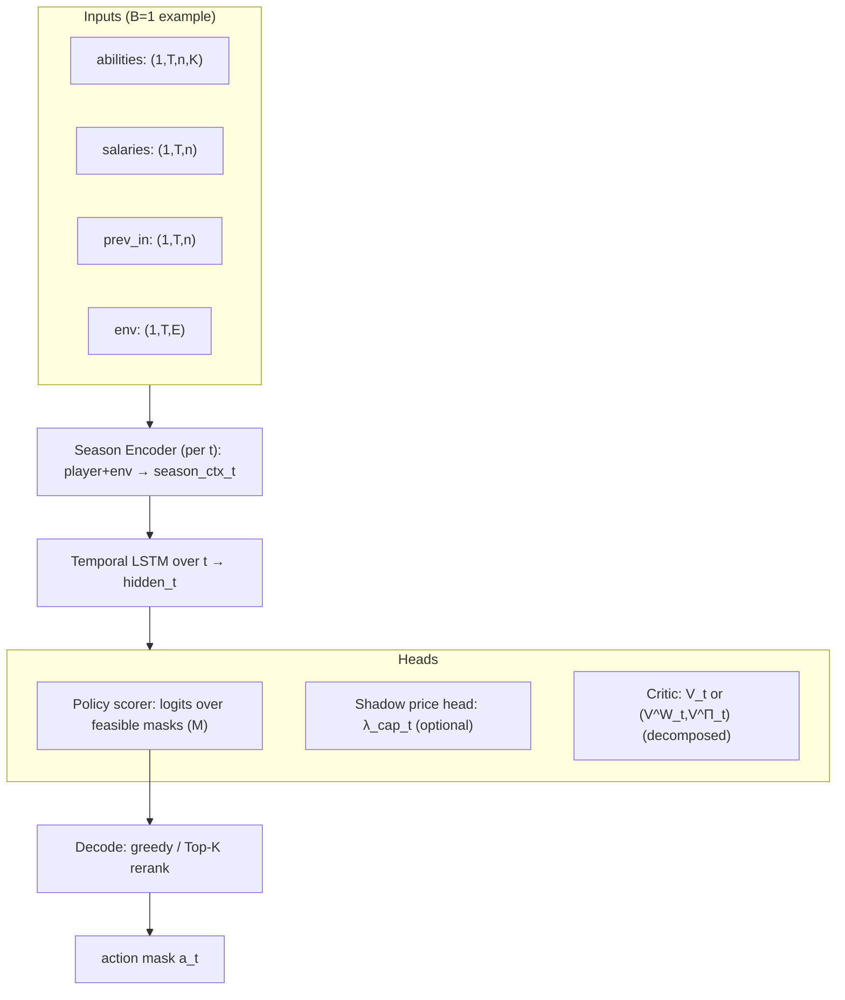
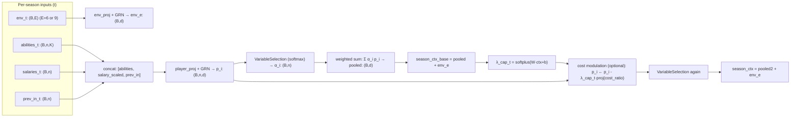
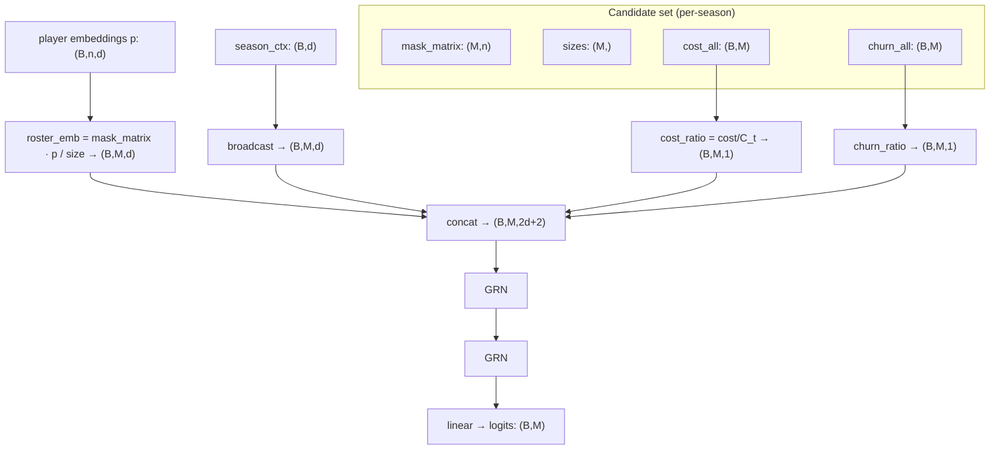
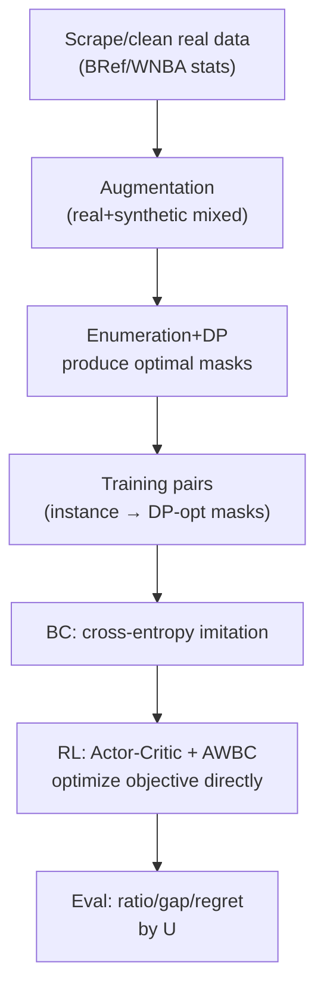

# Training Strategy (for non-ML readers)

This document explains the project’s **network structure**, **training recipe**, and **reinforcement learning algorithm**, with **interpretability** as the guiding theme:

- What does each module do and why is it needed?
- What interpretable quantity does it correspond to?
- What are the input/output tensor shapes (illustrated with `batch_size=1`)?
- Where does the RL reward come from, and how do gradients propagate back to the network?

The final configuration used in this repo includes:

- Constraint-aware environment features (cap/roster slack)
- A salary-cap shadow price head: $\lambda^{\mathrm{cap}}_t$
- Explicit cost modulation: $\tilde{a}_{i,t}=a_{i,t}-\lambda^{\mathrm{cap}}_t\,c_{i,t}$ (implemented as embedding-level subtraction modulation)
- A decomposed critic: predict wins $W$ and profit $\Pi$ components separately, then combine with $\lambda_{\mathrm{win}}$
- Top-K rerank decoding for inference/evaluation

Code entry points:

- Model: [src/mcm_2026_d/nn/model.py](src/mcm_2026_d/nn/model.py)
- Training (BC + RL + AWBC): [src/mcm_2026_d/nn/train.py](src/mcm_2026_d/nn/train.py)
- Evaluation (including Top-K rerank): [src/mcm_2026_d/nn/eval.py](src/mcm_2026_d/nn/eval.py)

---

## 1. Abstract the original problem as an MDP (state / action / reward)

Each sample `instance` describes a multi-season ($T$) roster decision process.

- **State** $s_t$: current-season player features + environment parameters + previous-season roster (roster inertia is the core temporal dependency)
- **Action** $a_t$: choose one **feasible roster mask** (a concrete roster)
- **Reward** $r_t$: derived from the problem objective (wins-profit trade-off + churn penalty, etc.; see [model_general.md](model_general.md))
- **Goal**: maximize discounted return $\sum_t \gamma^{t-1} r_t$

The exact method enumerates actions and runs DP to obtain $J^*(s)$; the neural network learns a policy $\pi_\theta(a\mid s)$ to approximate the optimum.

---

## 2. Key trick: compress the action space from $2^n$ to a finite feasible set

If we treat roster choice as independent multi-label selection, the action space is $2^{n_{players}}$, which is hard to train.

This repo instead:

1) Pre-enumerates all masks satisfying the roster-size constraint $L\le|roster|\le U$
2) Filters feasible masks per season using the salary-cap constraint
3) The model outputs logits only over these candidate actions (classification/sampling)

Result:

- Action = one explicit roster mask (directly interpretable as “this exact roster”)
- Policy output = scores (logits) over candidate rosters

---

## 3. Inputs and tensor shapes (example with `batch_size=1`)

Assume a typical small-scale training configuration:

- $B=1$ (for illustrating shapes; training often uses 32)
- $T=3$ seasons
- $n=15$ candidate players
- $K=6$ ability dimensions
- $M$ candidate masks (around 1k–2k depending on $L/U$)

Model inputs (to `TFTPolicy.forward(...)`):

- `abilities`: $(B,T,n,K)$ = $(1,3,15,6)$
- `salaries`: $(B,T,n)$ = $(1,3,15)$
- `prev_in`: $(B,T,n)$ = $(1,3,15)$ (float 0/1 indicating previous inclusion)
- `env`: $(B,T,E)$, where
  - base environment dimension is $E=6$
  - with constraint features enabled (final setup): +3 (cap_slack, cap_tightness, roster_slack), so $E=9$

Internally (candidate-action related):

- `mask_matrix`: $(M,n)$, one row per roster mask
- `sizes`: $(M,)$, roster size per mask
- `cost_all`: $(B,M)$, total salary per mask
- `churn_all`: $(B,M)$, churn vs. previous roster per mask

---

## 4. High-level model diagram (Level 1)

This diagram shows only the main modules for a quick overall picture.

Interpretability keywords:

- `player_importance`: variable-selection weights → “which players matter for this decision”
- $\lambda^{\mathrm{cap}}_t$: shadow price → “how tight is the cap / how sensitive to cost”
- Decomposed critic → “wins vs. profit value decomposition”

---

## 5. Season Encoder (Level 2: expanded submodules)

Season Encoder is the most interpretable part: it compresses player features, costs, previous roster, and environment into a season context vector `season_ctx`, and outputs player importance weights.

### 5.1 Constraint features in `env` (why add them?)

With `use_constraint_env=True`, we append three derived quantities to `env_t`:

- `cap_tightness`: previous roster salary / cap
- `cap_slack = 1 - cap_tightness`
- `roster_slack`: remaining headroom to the upper bound $U$ (the code approximates $U$ via the max candidate mask size)

Purpose: make the policy explicitly sensitive to “how tight the constraints are”, reducing collapse when changing $U$ or the cap.

### 5.2 Shadow price $\lambda^{\mathrm{cap}}_t$ (why interpretable?)

If the cap is tight, the policy should be more cost-saving; if the cap is loose, it can select stronger but more expensive players.

We output a scalar head $\lambda^{\mathrm{cap}}_t\ge 0$ to represent “cost sensitivity / cap shadow price”.

- Larger $\lambda^{\mathrm{cap}}_t$: cost matters more (closer to a Lagrange multiplier intuition)
- Smaller $\lambda^{\mathrm{cap}}_t$: ability matters more

### 5.3 Cost modulation (why it helps)

Instead of using cost only as a scorer input, we inject cost into player representations early:

$$
\mathbf{p}_{i,t} \leftarrow \mathbf{p}_{i,t} - \lambda^{\mathrm{cap}}_t\,\mathrm{Proj}(c_{i,t}/C_t)
$$

This pushes “price/value-for-money” signals into player embeddings so that variable selection and roster representations align better with constrained-optimization intuition.

---

## 6. Candidate Scorer (Level 2: score each candidate roster)

The policy does not score players independently; it scores each **candidate roster mask** as a whole.

Interpretability:

- Each candidate action is a concrete roster; you can output “Top-K rosters the model likes” and re-compute the objective.
- `cost_ratio` and `churn_ratio` are explicit scorer features, enabling explanations like “why change players / why keep continuity”.

---

## 7. Critic (value function) and decomposed interpretability

The per-season reward (see [model_general.md](model_general.md)) is a weighted combination of wins and profit:

$$
r_t = \lambda_{\mathrm{win}}\frac{W_t}{W^{\ast}} + (1-\lambda_{\mathrm{win}})\frac{\Pi_t}{\Pi^{\ast}}.
$$

With `critic_decompose=True`, the critic predicts both components:

- $V^W(s_t)$: expected discounted return of the wins component
- $V^\Pi(s_t)$: expected discounted return of the profit component

and combines them with the same weight:

$$
V(s_t)=\lambda_{\mathrm{win}}V^W(s_t)+(1-\lambda_{\mathrm{win}})V^\Pi(s_t).
$$

Why this is more interpretable:

- You can inspect “how many future wins / how much future profit the model expects”.
- When the policy becomes more aggressive or conservative, you can attribute changes to $V^W$ vs. $V^\Pi$.

---

## 8. Decoding strategy: greedy vs. Top-K rerank (why it can exceed 0.9 ratio)

### 8.1 Greedy (Top-1)

The simplest inference: choose the roster with the largest logit.

- Pros: fast
- Cons: a small scoring error at Top-1 can cause a noticeable regret

### 8.2 Top-K rerank decoding (final choice)

At inference time:

1) Take Top-K candidate rosters by logits
2) Re-evaluate each candidate using the same reward/objective formula in the environment
3) Choose the candidate with the highest re-evaluated reward

Intuition:

- The network filters a large action set down to a small set of plausible candidates (learns structural priors).
- The environment formula provides accurate scoring within that small set (avoids single-point Top-1 mistakes).

---

## 9. Training pipeline (BC → RL → Evaluation)

---

## 10. RL details: reward, advantage, and gradient flow

### 10.1 Rollout: obtain rewards from the environment

Each sample in a batch is an episode:

1) At season $t$, the policy outputs logits over candidate masks
2) Sample (or act greedily) to obtain action $a_t$
3) The environment computes the immediate reward $r_t=r(s_t,a_t)$ using the problem formulas and constructs the next state $s_{t+1}$
4) Repeat until $t=T$

Key point: reward is not a hand-crafted proxy; it matches the same objective decomposition used by the DP solver.

### 10.2 Monte-Carlo returns and advantage

Because $T$ is small (e.g., 3), we use Monte-Carlo returns:

$$
G_t = \sum_{k=0}^{T-1-t} \gamma^k r_{t+k}.
$$

Advantage:

$$
A_t = G_t - V(s_t).
$$

### 10.3 Actor gradient (policy gradient)

Core actor loss:

$$
\mathcal{L}_{pg}= -\mathbb{E}\big[\log \pi_\theta(a_t\mid s_t)\,A_t\big].
$$

Gradients flow through $\log \pi_\theta(a_t\mid s_t)$ back to:

- player embeddings (abilities/cost/previous inclusion)
- variable-selection weights (`player_importance`)
- the candidate scorer (logits over rosters)

Thus reward signals drive the network to prefer rosters that yield higher objective.

### 10.4 Critic gradient (value regression)

Critic loss regresses to $G_t$:

$$
\mathcal{L}_{v}=\mathbb{E}[(V(s_t)-G_t)^2].
$$

With a decomposed critic, we regress both component returns (wins and profit) and jointly train with the combined value so the interpretability decomposition does not collapse.

### 10.5 AWBC (why it stabilizes)

RL sampling introduces exploration noise; discarding the teacher entirely can cause policy drift.

AWBC adds an “advantage-weighted imitation” term during RL:

- Larger $A_t$ indicates the behavior is better than the current baseline
- We both increase the probability of that behavior and encourage staying aligned with DP-like actions

---

## 11. Metrics: why we focus on ratio/gap/regret (grouped by U)

The DP optimum can have multiple optimal solutions, so strict action-match accuracy can underestimate policy quality.

We therefore report (grouped by $U\in\{11,12,13\}$):

- `val_obj_ratio_mean`: $J^\pi/J^*$ (closer to 1 is better)
- `val_gap_mean`: $(J^*-J^\pi)/(\lvert J^*\rvert+\epsilon)$ (closer to 0 is better)
- `val_regret_mean`: $J^*-J^\pi$ (closer to 0 is better)

See [plots.md](plots.md) for plot interpretation.
