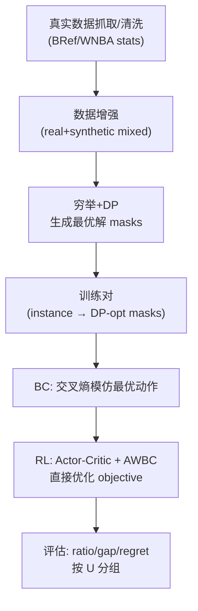

# 训练方案说明（面向非 ML 读者）

本文档解释本项目的**神经网络结构**、**训练方案**与**强化学习算法**，并把“可解释性”作为主线：

- 每个模块做什么？为什么需要它？它对应什么可解释的量？
- 输入输出张量维度是什么（用 `batch_size=1` 举例）？
- 强化学习的 reward 从哪里来？梯度如何传播回网络？

最终采用的版本是：

- 约束特征 env（cap/roster slack）
- 工资帽影子价格（shadow price）头：$\lambda^{\mathrm{cap}}_t$
- 显式成本调制（cost modulation）：$\tilde{a}_{i,t}=a_{i,t}-\lambda^{\mathrm{cap}}_t\,c_{i,t}$（实现为 embedding 级别的减法调制）
- critic 分项：分别预测胜场项 $W$ 与利润项 $\Pi$，再用 $\lambda_{\mathrm{win}}$ 合成
- 推理/评估采用 Top-K 复评解码（Top-K rerank）

代码入口：

- 模型：[src/mcm_2026_d/nn/model.py](src/mcm_2026_d/nn/model.py)
- 训练（BC + RL + AWBC）：[src/mcm_2026_d/nn/train.py](src/mcm_2026_d/nn/train.py)
- 评估（含 Top-K 复评）：[src/mcm_2026_d/nn/eval.py](src/mcm_2026_d/nn/eval.py)

---

## 1. 把原问题抽象成 MDP（状态/动作/奖励）

每条样本 `instance` 描述一个多赛季（$T$）的阵容决策过程。

- **状态** $s_t$：当季球员特征 + 环境参数 + 上一赛季阵容（阵容惯性是时序依赖的核心）
- **动作** $a_t$：选择一个“可行 roster mask”（一个具体阵容）
- **奖励** $r_t$：由题目 objective 分解得到（胜场与利润权衡 + churn 惩罚等；见 [model_general.md](model_general.md)）
- **目标**：最大化折扣回报 $\sum_t \gamma^{t-1} r_t$

传统方法通过枚举动作并 DP 求解得到 $J^*(s)$；神经网络学习一个策略 $\pi_\theta(a\mid s)$ 来近似最优。

---

## 2. 关键技巧：把动作空间从 $2^n$ 压缩为“有限可行集合”

如果直接做多标签选择，动作空间是 $2^{n_{players}}$，训练几乎不可行。

本项目做法：

1) 预先枚举所有满足人数约束 $L\le|roster|\le U$ 的 bitmask
2) 在每个赛季结合工资帽筛选可行动作
3) 模型只在这些候选动作上输出 logits（分类/采样）

结果：

- 动作 = 一个明确的 roster mask（可直接解释为“这套阵容”）
- policy 输出 = 对候选 roster 的打分（logits）

---

## 3. 输入张量与维度（以 batch_size=1 举例）

我们假设典型小规模训练设置：

- $B=1$（解释维度用；训练时常用 32）
- $T=3$（赛季数）
- $n=15$（候选球员数）
- $K=6$（能力维度）
- $M$（候选 roster mask 数，约 1k~2k 量级，取决于 $L/U$）

模型输入（进入 `TFTPolicy.forward(...)`）：

- `abilities`: $(B,T,n,K)$ = $(1,3,15,6)$
- `salaries`: $(B,T,n)$ = $(1,3,15)$
- `prev_in`: $(B,T,n)$ = $(1,3,15)$，表示上一季阵容中每个球员是否入选（浮点 0/1）
- `env`: $(B,T,E)$，其中
  - 基础环境维度 $E=6$
  - 若启用约束特征（最终采用）：额外 +3（cap_slack, cap_tightness, roster_slack），因此 $E=9$

模型在每个赛季内部还会用到（候选动作相关）：

- `mask_matrix`: $(M,n)$，每行一个 roster mask
- `sizes`: $(M,)$，每个 mask 的人数
- `cost_all`: $(B,M)$，每个 mask 的工资总额
- `churn_all`: $(B,M)$，每个 mask 相对上一季的 churn

---

## 4. 网络结构总览（第 1 层：主模块图）

这张图只展示“主要模块”，用于快速建立整体认知。

解释性关键词：

- `player_importance`：变量选择权重，告诉你“哪些球员/特征在当前决策更重要”
- $\lambda^{\mathrm{cap}}_t$：影子价格，告诉你“工资帽紧不紧、成本敏感度有多强”
- 分项 critic：分别预测胜场与利润的“可解释价值分解”

---

## 5. Season Encoder（第 2 层：展开到子模块）

Season Encoder 是“可解释性最强”的部分：它把球员特征、成本、上一季阵容与环境，压缩成一个赛季上下文向量 `season_ctx`，并输出每个球员的重要度权重。

### 5.1 约束特征 env（为什么要加？）

最终采用的 `use_constraint_env=True` 会把以下 3 个量拼到 `env_t`：

- `cap_tightness`：上一季阵容工资 / 工资帽
- `cap_slack = 1 - cap_tightness`
- `roster_slack`：上一季人数距离上界 $U$ 的“余量”（代码用候选动作 sizes 的最大值近似 $U$）

目的：让策略对“当前约束紧不紧”更敏感，减少换 $U$ 或换 cap 时的崩溃。

### 5.2 影子价格 $\lambda^{\mathrm{cap}}_t$（为什么可解释？）

当工资帽变紧时，合理策略应更“节省 cap”；当 cap 很松时，应更大胆选强但贵的球员。

我们用一个标量头输出 $\lambda^{\mathrm{cap}}_t\ge 0$ 来表示“成本敏感度/约束影子价格”。

- $\lambda^{\mathrm{cap}}_t$ 大：成本更重要（更像拉格朗日乘子）
- $\lambda^{\mathrm{cap}}_t$ 小：能力更重要

### 5.3 成本调制（为什么有效？）

不是把 cost 只当作 scorer 的一个输入，而是显式进入“球员表示”：

$$
\mathbf{p}_{i,t} \leftarrow \mathbf{p}_{i,t} - \lambda^{\mathrm{cap}}_t\,\mathrm{Proj}(c_{i,t}/C_t)
$$

这会把“价格/性价比”的信息更早地注入到 player embedding，使变量选择权重与 roster 表示更符合约束优化直觉。

---

## 6. Candidate Scorer（第 2 层：对每个候选 roster 打分）

policy 并不是逐球员独立打分，而是对“候选 roster mask”整体打分。

可解释性：

- 每个候选动作就是一个具体 roster，你可以直接输出“模型最喜欢的 Top-K roster”并复算 objective
- `cost_ratio` 与 `churn_ratio` 作为显式特征进入 scorer，便于解释“为什么换人/为什么不换”

---

## 7. Critic（价值函数）与“分项可解释性”

我们定义单赛季奖励（见 [model_general.md](model_general.md)）为胜场与利润的加权：

$$
r_t = \lambda_{\mathrm{win}}\frac{W_t}{W^{\ast}} + (1-\lambda_{\mathrm{win}})\frac{\Pi_t}{\Pi^{\ast}}
$$

最终采用 `critic_decompose=True`，让 critic 同时预测两项：

- $V^W(s_t)$：胜场项的期望折扣回报
- $V^\Pi(s_t)$：利润项的期望折扣回报

并按同一权重合成：

$$
V(s_t)=\lambda_{\mathrm{win}}V^W(s_t)+(1-\lambda_{\mathrm{win}})V^\Pi(s_t)
$$

为什么更可解释：

- 你可以单独看“模型认为未来胜场还能拿多少/利润还能赚多少”
- 当策略变得更激进或更保守时，可以把变化归因到 $V^W$ 或 $V^\Pi$

---

## 8. 解码策略：Greedy vs Top-K 复评（为什么最后能冲过 0.9）

### 8.1 Greedy（Top-1）

最简单做法：选 logits 最大的 roster。

优点：快；缺点：一旦 logits 的 Top-1 因为轻微估计误差选错，就会造成明显 regret。

### 8.2 Top-K 复评解码（最终采用）

推理时：

1) 取 logits 的 Top-K 候选 roster
2) 用环境里同一套 reward/objective 公式对候选动作“复评”
3) 选复评 reward 最大的那个动作

直觉：

- 网络负责“从海量候选里筛出少量靠谱候选”（学习到结构化先验）
- 环境公式负责“在少量候选里算得更准”（避免 Top-1 单点失误）

---

## 9. 训练流程（BC → RL → 评估）

---

## 10. 强化学习细节：reward、优势、以及梯度怎么传播

### 10.1 rollout：从环境拿到 reward

每个 batch 中的每条样本是一个 episode：

1) 在赛季 $t$，policy 输出 logits over candidate masks
2) 从分布采样（或贪心）得到动作 $a_t$
3) 环境用题目公式计算即时奖励 $r_t = r(s_t,a_t)$，并构造下一状态 $s_{t+1}$
4) 重复到 $t=T$ 结束

> 关键点：reward 不是“拍脑袋的 proxy”，而是和 DP 求最优时同一套 objective 分解公式。

### 10.2 Monte-Carlo 回报与优势

由于 $T$ 很小（例如 3），我们用 Monte-Carlo 回报：

$$
G_t = \sum_{k=0}^{T-1-t} \gamma^k r_{t+k}
$$

优势：

$$
A_t = G_t - V(s_t)
$$

### 10.3 Actor 的梯度（policy gradient）

Actor 的核心损失：

$$
\mathcal{L}_{pg}= -\mathbb{E}\big[\log \pi_\theta(a_t|s_t)\,A_t\big]
$$

梯度会通过 $\log \pi_\theta(a_t|s_t)$ 回传到：

- player embedding（能力/成本/上一季入选）
- 变量选择权重（player_importance）
- scorer（对候选 roster 的打分）

因此 reward 信号会“驱动网络学会偏好能带来更高 objective 的 roster”。

### 10.4 Critic 的梯度（value regression）

Critic 的损失是回归 $G_t$：

$$
\mathcal{L}_{v}=\mathbb{E}[(V(s_t)-G_t)^2]
$$

当使用分项 critic 时，我们会同时回归两项回报（胜场项与利润项），再与合成 value 一起训练，使“可解释分解”不会退化成无意义的分量。

### 10.5 AWBC：为什么能稳定训练

RL 采样会引入探索噪声；若完全抛弃老师，容易出现策略漂移。

AWBC 在 RL 阶段增加一个“优势加权的模仿损失”，直觉是：

- 当某个轨迹/动作的 $A_t$ 更大时，说明它比当前基线更好
- 那么除了提升该动作的概率，也更倾向于保持与 DP 老师的一致性

---

## 11. 指标口径：为什么只看 ratio/gap/regret（按 U 分组）

DP 最优可能存在多解，所以动作匹配率（accuracy）会低估策略质量。

我们固定口径只看（按 $U\in\{11,12,13\}$ 分组）：

- `val_obj_ratio_mean`：$J^\pi/J^*$（越接近 1 越好）
- `val_gap_mean`：$(J^*-J^\pi)/(\lvert J^*\rvert+\epsilon)$（越接近 0 越好）
- `val_regret_mean`：$J^*-J^\pi$（越接近 0 越好）

对应图解见 [plots.md](plots.md)。

